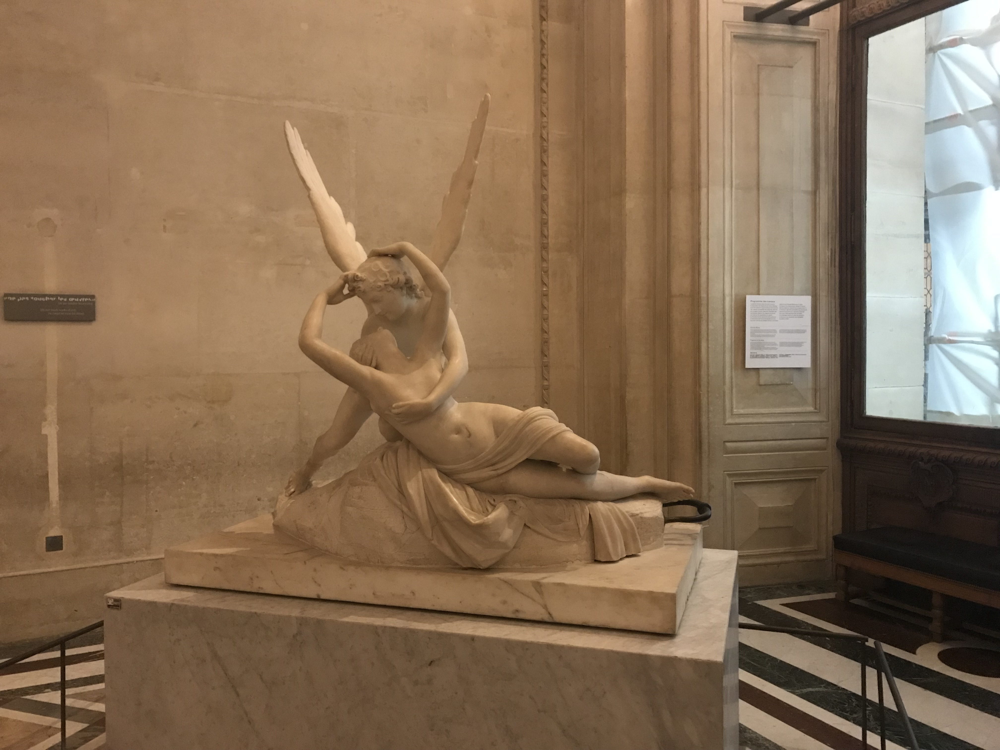
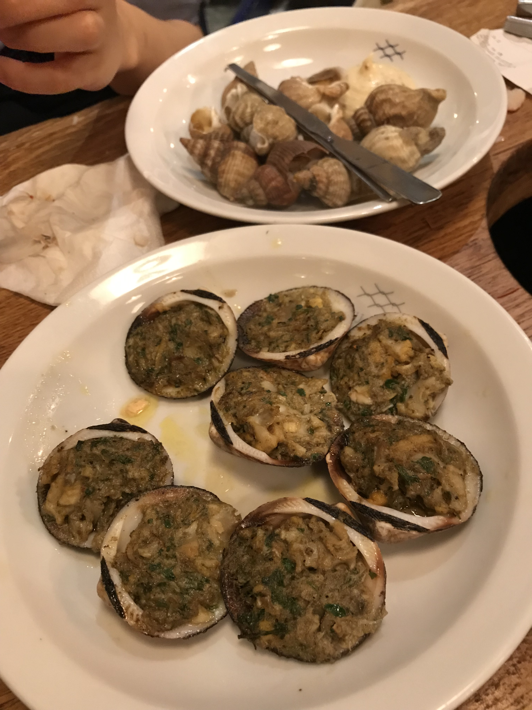
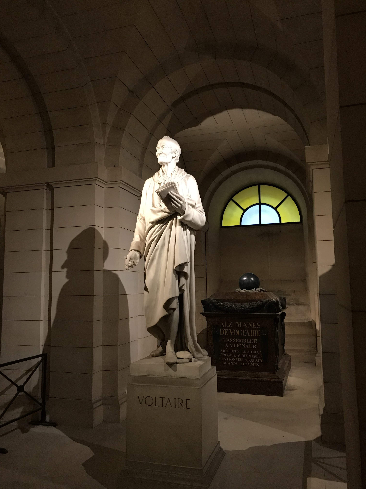
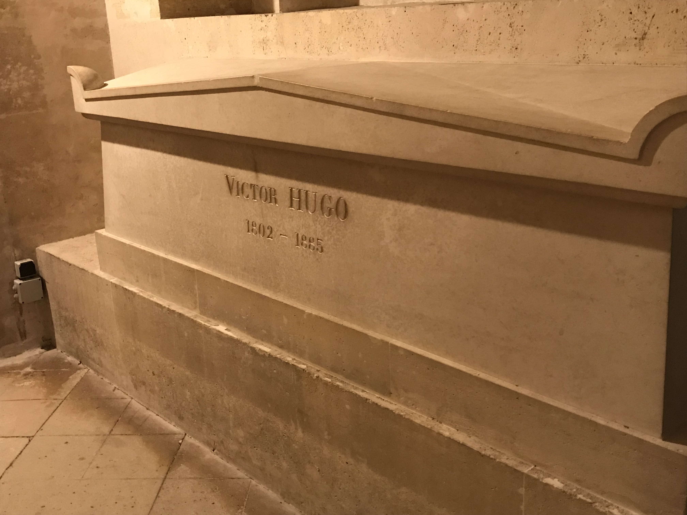

[返回目录](index.md)

## 十、巴黎

- 时间：2019年10月25日~10月27日
- 同伴：mhy, qhf, zzw
- 交通：火车
- 路线：曼海姆 - 巴黎 - 曼海姆
- 当地交通：暴走+Uber
- 游玩景点：
    - 卢浮宫
    - 凯旋门
    - 埃菲尔铁塔
    - 先贤祠
    - 老佛爷

### 10.25 DAY1: 

周五中午一点多出发，傍晚五点左右到达巴黎。入住后与已经在逛街的周小姐汇合，选了家叫“俏江南”的中餐厅吃饭。菜单上看上去像川菜，结果被我发现是福建人开的……专门点了鱼丸，结果根本不是！md气死了，而且做的菜红是很红，一点都不会辣，没意思。

饭后我们直奔**卢浮宫**！之所以刚到的这天晚上就去，是因为我们看到周五晚18:00到21:45凭学生证可以免费进卢浮宫，这么好的机会我们怎么可能错过hhh

卢浮宫名不虚传，外头的pyramid在夜色中闪着清亮的白光，将钢筋线条映衬得格外清晰，美得分明。而我更向往的是宫内。

{:height="200px"}

现在还记忆犹新，进入后刚走几步路，一个转角，目光沿着向上的台阶触碰到矗立在正中的胜利女神像时，那打在洁白大理石上的白光仿佛爆炸一般，将要戳破眼角，有如璀璨的星云在无垠的宇宙欲作磅礴之势。接下来的两个小时里，我一直怀着这种膨胀感，直至吸进卢浮宫外巴黎夜晚的冷空气。

{:height="200px"}
{:height="200px"}

在宽阔的过道内漫步，随时会有一张熟悉的面孔出现，让你“哦”的一声惊呼。我并没有特意寻找游览攻略，为的正是这种惊喜。徜徉在熟悉与不熟悉的美之间，不禁想起小说中主人公闲来无事便前往卢浮宫打发时间的情节。过去在向你招手，巴黎为你斟满又一杯酒，哦，午夜的巴黎。

{:height="200px"}
{:height="200px"}
{:height="200px"}
{:height="200px"}
{:height="200px"}
{:height="200px"}
{:height="200px"}
{:height="200px"}
{:height="200px"}
{:height="200px"}
{:height="200px"}
{:height="200px"}

半带刻意，半带误打误撞地，我认出了Isabella他们仨携手飞奔过的展厅。追随脑海中“踏踏”的脚步声，我一路小跑下楼，想要和他们一样大笑着奔跑，但又极力克制自己，担心被赶出去（被当作傻瓜倒无所谓）。可惜的是当时他们出去的门似乎已被关闭，没法像他们一样拥抱着喊：“We accept him. One of us!”

{:height="200px"}
{:height="200px"}
{:height="200px"}
{:height="200px"}
{:height="200px"}

在离馆前五分钟，我甚至还特意上回二楼，重新跑了一遍这条路线，才恋恋不舍地从梦中醒来。

{:height="200px"}

### 10.26 DAY2: 

第二天我们开启暴走模式，从旅店出发，走过巴黎歌剧院

{:height="200px"}
{:height="200px"}
{:height="200px"}
{:height="200px"}
{:height="200px"}

协和广场

{:height="200px"}
{:height="200px"}

香榭丽舍大街，皇宫

{:height="200px"}

凯旋门

{:height="200px"}
{:height="200px"}

然后穿过塞纳河到达埃菲尔铁塔

{:height="200px"}

在巴黎战神广场拍了些游客照hhh

{:height="200px"}

说到铁塔，我就想起来我看完《达芬奇密码》全书唯一记得的情节……就是主人公刚到巴黎时出租车司机指着铁塔开玩笑问主人公是否上过她（mount her）。

{:height="200px"}
{:height="200px"}

将近傍晚到达奥赛博物馆。奥赛博物馆主要是印象派的画，因为时间紧就挑了顶层参观，莫奈，马奈，高更，梵高，塞尚，雷诺阿，每一幅画都是名家，都是精品，甚至都有些审美疲劳了。

{:height="200px"}
{:height="200px"}
{:height="200px"}
{:height="200px"}
{:height="200px"}
{:height="200px"}
{:height="200px"}
{:height="200px"}

有点遗憾就是来之前没做好功课，有些著名的画没有注意到（当然，这样说太功利了）。不过纪念品店就像考试一样，检查自己有没有错过明信片上的画作hhh

晚上去了一家海鲜店吃，每一盘都很新鲜，人均30吧，不错！

{:height="200px"}
{:height="200px"}
{:height="200px"}
{:height="200px"}
{:height="200px"}

### 10.27 DAY3：

巴黎，下雨了，真好呀。（~~别装了，你就是因为没带伞才淋雨走路的~~

先贤祠，又是打卡名人安身之处的地方。

{:height="200px"}
{:height="200px"}
{:height="200px"}
{:height="200px"}
{:height="200px"}
{:height="200px"}
{:height="200px"}
{:height="200px"}

强烈建议大家旅游之前做好攻略，一定要弄清那些人的英文名……否则就会像我一样经过了写着Exupery的石头，却在纪念品店才后知后觉地看到一堆小王子……以及前一天甚至没有认出雷阿诺的名字……我太菜了

之后在塞纳河中心的岛上远观了巴黎圣母院，唉，可惜。

然后就是激动人心的“马老板带你出道”环节！沉迷于周董的马老板特意把我们拉到一个mv的拍摄地点，来了个自导自演的模仿秀【滑稽】

{:height="200px"}
{:height="200px"}

下午去老佛爷逛街。然而我既买不起什么也不懂要买啥，就没啥好说的了。倒是在书店看到了装帧精良的这本书，这纸质，这里边的地图、手稿，我爱了，可惜是法文，如果是英文说不定我就剁手了。

{:height="200px"}

傍晚在吃了一盆比脸还大却只要10欧但依然一点都不辣的小面过后，各回各家。

巴黎，多少文人墨客心之所向的艺术之都，有缘我们一定会再见的！

{:height="200px"}

&nbsp;

---

THE END

&nbsp;

[回到顶端](#十巴黎)

[返回目录](index.md)