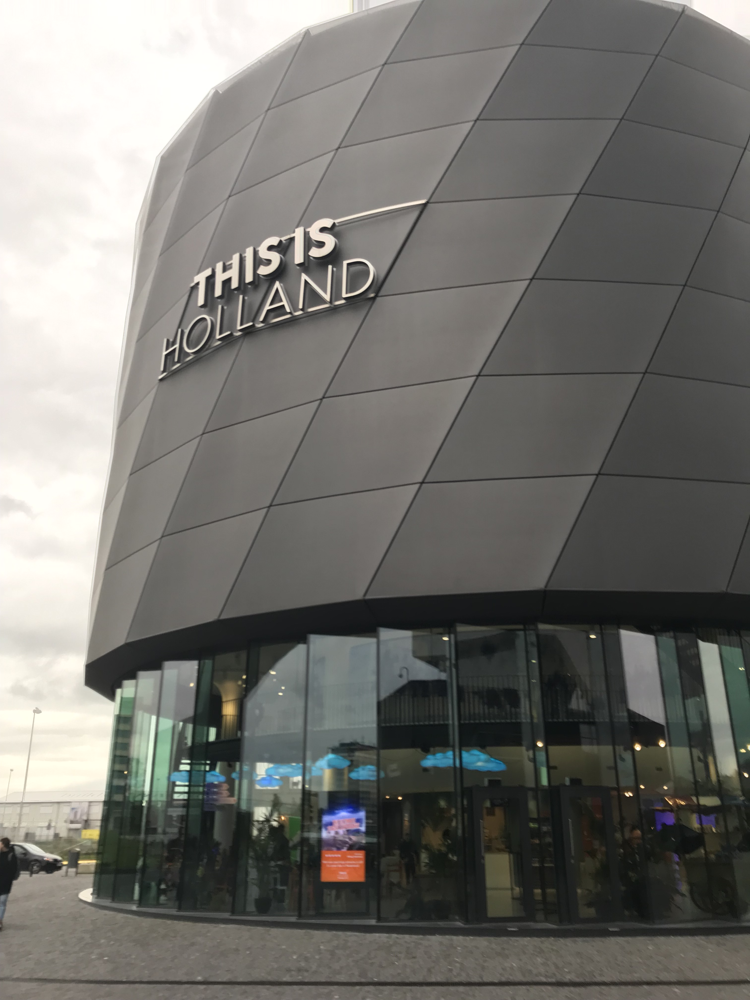

[返回目录](README.md)

## 十一、荷兰

- 时间：2019年11月1日~11月4日
- 同伴：qhf, yyc, zyx
- 交通：火车
- 路线：曼海姆 - 阿姆斯特丹 - 法兰克福 - 曼海姆
- 当地交通：步行，地铁，电车
- 游玩景点：
    - sex museum
    - Amsterdam Dungeon
    - 国家博物馆
    - Casa Rosso
    - Lookout Swing
    - This is Holland
    - 梵高美术馆

### 11.1 DAY1: 

周五中午出发，傍晚五点半到达阿姆斯特丹，天已经完全黑了。入住并吃过晚餐后前往**sex museum**。

说实话它并没有想象中的那么好玩，略有失望。里面陈列的东西就比较直白而已，有一些古老的照片、录像，也有奇奇怪怪的雕塑，但看起来很廉价的样子。也有homo啊sm啊等不同类型，照片良莠不齐，多数没啥看头，看不过几分钟就会疲劳。我甚至还在里边看到了穆夏的介绍，有些莫名其妙，不知道本该在布拉格的他为啥会出现在这里。鉴于较为便宜的价格，也就这样吧~（没有照片，文明上网【呲牙】）

### 11.2 DAY2: 

上午去**Amsterdam Dungeon**玩。这是个类似鬼屋的地方，还蛮推荐的，里头布置得不错，NPC们表演得也很卖力，很有气氛。鉴于不让拍照就还是没有照片orz 

其中有一个场景是找出之前被判为女巫的观众，要火烧她。NPC指定了前排的yyc爸爸让她来找，然而我们都忘了之前哪位朋友是女巫了，于是在我们的哄笑声中NPC就把yyc当作女巫绑在柱子上，带着我们一起喊“Burn the witch！”点火把她烧了。其实就是柱子在干冰的掩护下转了180度，露出一具烧焦的尸体模型。看到模型时，zyx爸爸嘀咕：“yyc变高了…”可把我们笑死了。之后yyc爸爸还得到了NPC送的一张奖状作为鼓励hhh

然后就去**国家博物馆**咯。有著名的伦勃朗的**夜巡**，然而竟然在检修…真不幸。

{:height="200px"}

照例上一波图。

{:height="200px"}
{:height="200px"}
{:height="200px"}
{:height="200px"}
{:height="200px"}

我最喜欢的一幅画是这个牧女，我也不懂为啥，感觉她的眼神充满活力。

{:height="200px"}

还有无敌的荷兰舰队。

{:height="200px"}
{:height="200px"}

博物馆里还藏着个图书馆。

{:height="200px"}

这些小精致的小房间也让人眼前一亮。

{:height="200px"}
{:height="200px"}

逛到两点多我们饿了，便找了家日料自助，敞开肚皮，吃到五点多，真正的从天亮吃到天黑、午餐晚餐全包。（抱歉还是没有图，用沿途风景代替一下）

{:height="200px"}
{:height="200px"}

终于，到了游览阿姆斯特丹某特色区域的时候了！随着夜幕降临，河畔红色的灯光亮起，充满诱惑的橱窗，迷幻的大麻气息，三教九流的人们，阿姆的夜生活正式开始！

我们直奔看show的地方，45欧的票呢，要好好观赏【

{:height="200px"}

总体来说表演挺精彩，可以说是很值得票价的。我们看了快有两轮，最让我惊艳的是钢管舞小姐姐，简直是杂技/体操演员了！原本我以为她只是绕着钢管跳着不痛不痒的舞，结果一上来直接硬核人体旗帜，瞬间被圈粉。然后各种超级无敌体操动作，我惊得下巴都要掉了，羡慕得都快哭出来！

还有一个节目是猛男黑哥哥警察，请一排女观众上台，黑哥哥也很能演，全场气氛瞬间点爆，大家都大喊着鼓掌。

qhf甚至还不舍得离开，想再看一眼她最喜欢的学生制服小姐姐hhh 最后我们十一点多才回到住处，算是旅游以来晚上浪得最久的一次了。

### 11.3 DAY3：

同样佛系的第三天开始了。首先我们乘摆渡船去了**Lookout**楼顶俯瞰阿姆并坐了楼顶的**Swing**。

{:height="200px"}

即使是阴天风景也是不错滴。

{:height="200px"}

秋千还挺舒服的，是在楼的边沿，荡的时候仿佛悬空，也有玩娱乐项目的那种离心感，就是时间有点短，不够过瘾。这里没有好看的照片，就不发了。

接着去预约好了的**梵高美术馆**。我看到入口好像画着不能拍照的标识，就没有拍照留念。梵高的画就不多说了，天才就是天才，看的时候不知为何想起了《月亮与六便士》，似乎能感受到画中一种原始的力量涌动。（于是买了二十多张明信片……）

然后又跳过了午饭，智障操作穿过全城重新回到早上Lookout的边上，体验**This is Holland**。

{:height="200px"}

这个圆柱形的建筑物里就是类似那种我也不懂叫啥的娱乐项目……一个球形房间，人坐在类似过山车的座位上，半球形大屏幕上放着影像，配合座椅的移动和失重超重感觉的制造，形成一种4D的感官冲击。

我们在里面就化身为鸟儿（或飞机？）从空中游览了荷兰的主要风光，很美，很舒服，推荐。

晚上去了大家都推荐的Seafood Bar吃海鲜，实惠又美味，三个人大概90欧，能吃得很舒服。

{:height="200px"}
{:height="200px"}

### 11.4 DAY4：

回程。傍晚和马老板、mwx约了法兰的火锅，满意地为旅行收尾。

{:height="200px"}
{:height="200px"}

这次阿姆之行主要是体验各个室内的（要花钱的）景点，没有去打卡很多著名景点，比较佛系。照片也不多，一来是这些室内很多不让拍照，二来荷兰日常天气不好，下着雨，亲身体验不错但照片就拍不出那种效果。总之，阿姆，大城市，啥都有【手动滑稽】

{:height="200px"}

&nbsp;

---

THE END

&nbsp;

[回到顶端](#十一荷兰)

[返回目录](README.md)