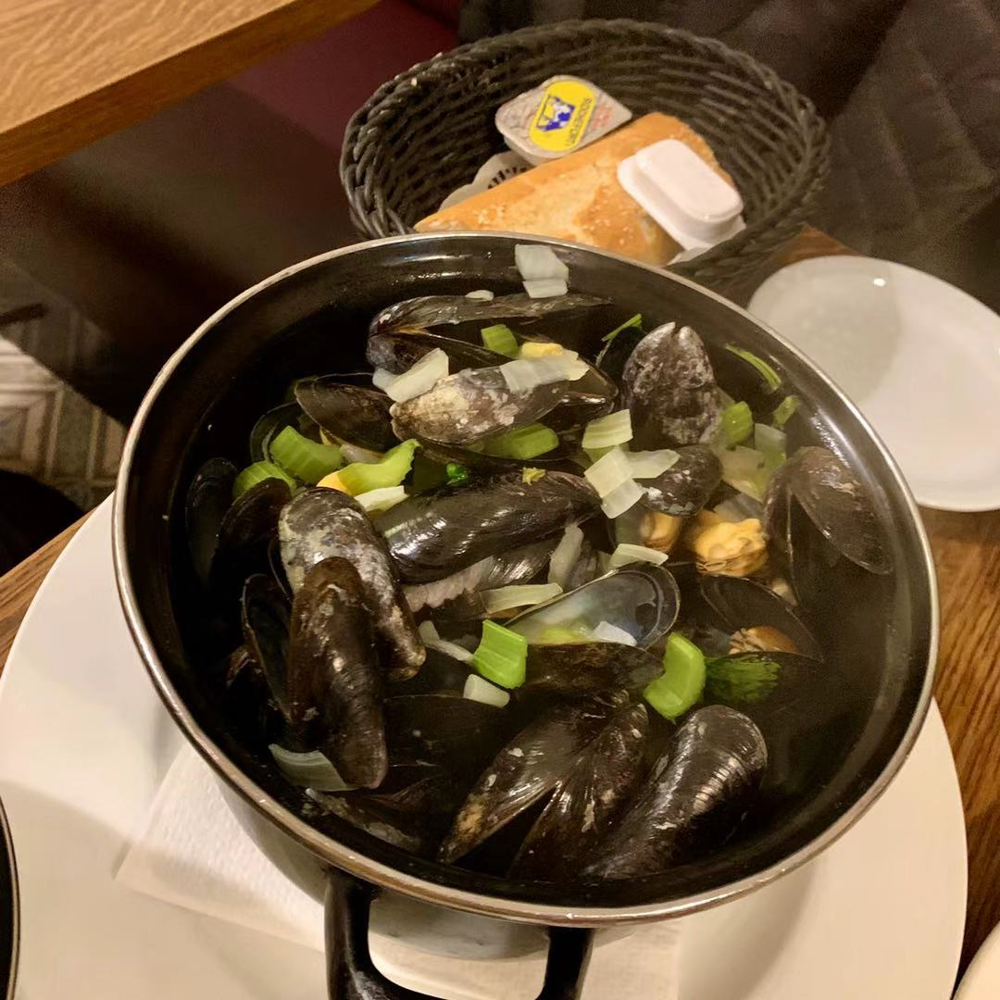

[返回目录](README.md)

## 十二、比利时

- 时间：2019年11月8日~11月11日
- 同伴：zzw
- 交通：火车
- 路线：曼海姆 - 布鲁塞尔 - 安特卫普 - 布鲁塞尔 - 鹿特丹 - 曼海姆
- 当地交通：步行，地铁，电车
- 游玩景点：
    - 布鲁塞尔：撒尿小童，撒尿小妹，布鲁塞尔大广场，圣于贝尔长廊，比利时漫画艺术中心
    - 安特卫普：河畔博物馆，Steen城堡，布拉博喷泉

### 11.8 DAY1 Brussels: 

中午出发，傍晚到达布鲁塞尔。放下行李后直奔市中心和周爸爸吃晚饭。比利时特色的青口贝，盐焗蛙腿，炖牛肉，羊排，好吃的薯条，开启了两个巨能吃的吃货的美食之旅。【呲牙】

{:height="200px"}
{:height="200px"}
{:height="200px"}

平时出去玩吃饭基本是人均20欧左右，这次近乎翻倍，不过吃得是真的爽！

晚饭过后沿路逛回民宿，刚从餐厅起身没十分钟就坐进了一家巧克力蛋糕店。然而，这次翻车了……我们万万没有想到在布鲁塞尔竟然能吃到难吃的巧克力……

### 11.9 DAY2 Antwerp: 

第二天早上坐火车前往安特卫普。安特卫普的火车站有点意思，挺好看的。

{:height="200px"}

到达后周爸爸带路去有名的一家巧克力店吃了早午餐。对，半个小时前我们在火车上刚吃完了早餐… 这里的巧克力确实好吃！我们吃了马卡龙，一个巧克力蛋糕，黏黏的蛋糕芯会流出来的那种，还有一个树莓馅的蛋糕。照片肯定是拍了的，但由于某个特殊原因没有了，这个故事之后再讲…… 

顺便预告一下，这一天拍了好多照片，然而，emmm，下面放的是幸存下来的一小部分……

安特卫普街景：

{:height="200px"}
{:height="200px"}

吃完早午餐后前往**河畔博物馆**。这个奇奇妙妙的博物馆给周爸爸带来了无限的乐趣。

博物馆外围：

{:height="200px"}
{:height="200px"}
{:height="200px"}
{:height="200px"}
{:height="200px"}

这个博物馆是一个现代化的博物馆，里面展出的是一些非传统的东西，比如日本动漫馆

{:height="200px"}

比如 影 流 之 主 馆

{:height="200px"}
{:height="200px"}

还有比利时日常饮食啊、航海啊等方面的相对来说正常展馆

{:height="200px"}

到博物馆顶层还能俯瞰全城

{:height="200px"}
{:height="200px"}

这个餐厅的广告还蛮有意思

{:height="200px"}

逛完博物馆再次在周爸爸（的小红书）的带领下去到一家超好吃的海鲜小店。嫩嫩的虾，鲜美的海鲜汤，香脆的炸多春鱼和不知道叫什么的鱼，人均不到20欧，爽到！别想了，拍照了，但没图。

下午我们分头逛，我去了河边散步（吹冷风），比利时虽小，风景确实很棒。

{:height="200px"}
{:height="200px"}
{:height="200px"}
{:height="200px"}

晚上回到布鲁塞尔，晚饭吃中餐，好不容易遇到一家米饭随便盛的怎能放过，三大碗走起。当我俩吃得近乎在一天之内圆了一圈时，乐极生悲，前方持续高能。

回民宿的路上，忽然不知道从哪窜出两个棕皮肤的年轻人，其中一个棕哥哥冲上来一定要和我握手，看上去是喝醉了的样子。被逼到街边我就颇不情愿地伸出了手，他就紧紧抓住，还非常莫名其妙地用脚勾住了我的脚。我一脸？？？好在他应该是有点晕了，颠了两下便走开了。

之后的路上周爸爸和我两脸懵逼，还议论着刚刚的古怪遭遇。然而，一回到民宿，周爸爸发现手机不见了，精彩（又悲惨）的部分正式开始。

冷静分析后确定下手机是在从餐厅回民宿的路上不见了，要么是丢了，要么是被偷，其中那两个棕哥哥有很大嫌疑。打开苹果的搜索手机功能，查不到，基本确定是被偷后被关机了。

于是开始锁住手机信息，周爸爸发短信、微信给爸妈以及朋友们，用我手机和她闺蜜聊了一晚上，收获了无数“哈哈哈哈哈哈”和“嘎嘎嘎嘎嘎”。种种艰难困苦，在这不多做描述，周爸爸丢手机后唯一心疼的就是这天在安特卫普拍的无数满意的照片。

这愉快到上天又直坠落谷底的一天就以周爸爸的愁眉苦脸结束。

### 11.10 DAY3 Brussels: 

尽管经历了悲伤，玩乐还要继续！周日这天我们睡了个懒觉，去周爸爸（的小红书）推荐的华夫饼店吃早餐，然而小红书竟然翻车了… 排了队但华夫并不好吃，巧克力也不好喝（虽然看起来还行）。

{:height="200px"}

然后佛系逛了**撒尿小童**等一些景点，**撒尿小妹**太丑了就没拍了。

{:height="200px"}
{:height="200px"}

下午去**比利时漫画艺术中心**体会漫画之国的魅力。

{:height="200px"}

哦，丁丁！

{:height="200px"}
{:height="200px"}
{:height="200px"}

我们可爱的蓝精灵！

{:height="200px"}
{:height="200px"}

还有Bollie & Billie 等看上去有点熟悉其实并没有看过的动漫。

{:height="200px"}

最惊喜的是，在纪念品店，我竟然！看到了！Tolkien！真是惊到我了，今年才出的电影，这么快就有漫画了。

{:height="200px"}
{:height="200px"}

这个馆还是有很多有意思的东西的！漫画王国名不虚传！即使你不是漫画迷（比如我）也能享受其中的乐趣，推荐！

原本，我打算坐下午四点多的车回曼海姆，但因为周爸爸的车是六点多的，她又没手机，我就改为坐六点多的车咯。但就在我们悠闲地吃晚饭时，我打开DB Navigator查看火车信息，发现我的那趟火车赫然标着“journey cancelled”！！！！我整个人都不好了。

{:height="200px"}

这可以算是本次旅行的第二个高潮了…… 在短暂地冷静分析后，我决定和周爸爸一起前往鹿特丹，投奔周爸爸或秦狗。在周爸爸疯狂解释这曲折的故事+被疯狂“哈哈哈哈哈哈”之后，我成功获得了周爸爸宿舍里一间房的入住权。

在前往鹿特丹的火车上，回忆起这次旅行，我们疲倦得不愿多说一句话，只能生无可恋地互相苦涩地哈哈大笑。

嗯，这就是传说中极其硬核、及格了就是top学生的鹿特丹管理学院，也是我今晚将要投宿之处。【微笑面对生活】

{:height="200px"}

躺在两条瑜伽垫临时拼凑成的简易地铺，我不知是笑着还是哭着入睡了。

### 11.11 DAY4 Rotterdam: 

这始料未及的第四天，就睡了个懒觉，在周爸爸和秦狗的带领下逛了鹿特丹这个大城市的购物中心，体验了一下鲱鱼，但我觉得真的很鲜很好吃啊！我极度怀疑秦狗给我指错了。以及周爸爸推荐的冻酸奶，味道不错，但大冷天吃下这一个也有点困难。

{:height="200px"}

中午坐上火车，傍晚终于到达我心心念念的曼海姆。

这次旅行就不做总结了，说多了都是泪，多年以后我一定能很快想起这次奇妙冒险并露出同样苦涩的微笑吧……

{:height="200px"}

&nbsp;

---

THE END

&nbsp;

[回到顶端](#十二比利时)

[返回目录](README.md)