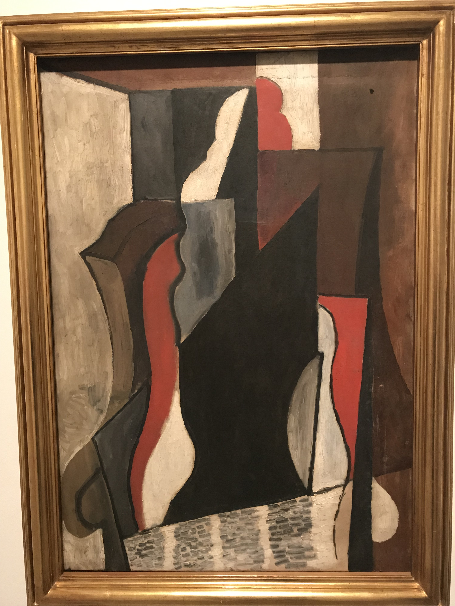

[返回目录](README.md)

## 十四、西班牙

- 时间：2019年11月22日~25日
- 同伴：mhy, qhf
- 交通：飞机
- 路线：曼海姆 - 法兰克福机场 - 巴塞罗那 - 法兰克福机场 - 曼海姆
- 当地交通：地铁
- 游玩景点：
    - 加泰罗尼亚广场
    - 毕加索博物馆
    - 巴塞罗那海滩
    - 蒙锥克城堡
    - 诺坎普球场
    - 古埃尔公园
    - 圣家堂
    - 巴特罗之家
    

### 11.22 DAY1: 

下午四点的飞机，体验了一回Lufthansa的航班，服务确实比廉航好很多（~~那不是废话吗~~）喝的可乐里会帮你加冰块和柠檬，很好喝。

{:height="200px"}

刚从机场坐地铁到青旅附近，就发生了这次旅行的第一件惨事。当时我正想找个饭店体验一下西班牙特色海鲜炒饭，然后秦狗给我发微信：“我钱包被偷了。”好在最终秦狗靠工作人员资助的钱成功来到市区，不然我可得去机场接她。

{:height="200px"}

历经千辛万苦到达青旅之后，秦狗生无可恋地说：“如果我再把手机丢了，那就完了。”（划重点，这里是个flag）

### 11.23 DAY2: 

第二天早上先去了以鸽子多而闻名的**加泰罗尼亚广场**。一大群鸽子扑面而来，眼前一片忽闪的白光，只听见扑棱棱的扇翅声，一动都不敢动，生怕哪一只就直撞上你了。

{:height="200px"}

打卡完成后便前往**毕加索博物馆**。毕加索不只画了抽象画，还有挺多“正常”的作品…

{:height="200px"}
{:height="200px"}
{:height="200px"}
{:height="200px"}
{:height="200px"}

吃过午饭，下一站就是海边了！路过**哥伦布纪念柱**。

{:height="200px"}

不像德国冻掉头的寒风，西班牙这里温暖如春，阳光下从码头沿着海边的人行道漫步，仿佛回到了厦门【捂脸】

{:height="200px"}

啊，海！沙滩！已经不记得上一次在沙滩玩耍是什么时候了，没看到还没有感觉，见到之后一种久别逢故人的心情油然而生，太感动了！

{:height="200px"}

果断脱下鞋袜，冲向浪花。美中不足的是这片沙滩的沙子不够细，有点磨脚。

{:height="200px"}
{:height="200px"}

在海边玩够了之后，我们打算去**蒙锥克山**看日落。沿途街景。

{:height="200px"}

途经一个博物馆，依山势而建，仿佛一座王宫，很有气派。

{:height="200px"}
{:height="200px"}
{:height="200px"}

爬山的路上发现自己低估了距离……虽然不陡，但还是蛮远的，走得jio疼。到顶后发现**蒙锥克城堡**就是个朴实无华的碉堡……俯瞰的视野还不错。

{:height="200px"}

落日闪耀的金黄色，天边渐变的粉色，与大海温柔的蓝色完美融合，简直不要太治愈。当然，这种美是辣鸡手机拍不出来的，就不放图了。哦，好像是压根没有拍，因为山顶的风差点把我吹成面瘫，为了保命就早早溜了。

{:height="200px"}

晚上与马老板顺利汇合，旅游局变为lol开黑局【x

### 11.24 DAY3: 

早上一起床就看到街上在跑马，惊了。

{:height="200px"}

最先前往的当然是马老板心心念念的**诺坎普球场**了。我不怎么看足球，比较无感，但马老板看起来很满足的亚子。

{:height="200px"}
{:height="200px"}
{:height="200px"}

正当我们参观完毕，坐地铁准备去吃午饭时，好戏开场了【手动滑稽】简而言之就是地铁上一个三人作案团伙vs我们三人，成功把秦狗的手机偷了。手法确实高明，毕竟人家干这行的，一个人先拉着我和马老板说话吸引注意，另外两人借着到站下车的机会干净利落地拿到秦狗手机。

于是秦狗便开始了苦逼的回归清净（没有手机）的生活。

该玩的还是得玩，下午前往**古埃尔公园**。这公园真的是让我大失所望，旅行攻略上的图片都蛮好看的，然而公园里却是荒凉的土路，成群的游客，和几个不大不小没啥特色的马赛克建筑、雕塑，没啥意思。

{:height="200px"}

虽然景色不好看，沙雕还是得沙雕起来！这次旅行前就怕算好要搞几个JoJo立了【呲牙】

{:height="200px"}
{:height="200px"}

失望地从公园出来后继续打卡一些著名景点，外边拍个照那种，因为进去参观太贵了，我们也没兴趣……

圣家堂。

{:height="200px"}
{:height="200px"}

巴特罗之家。

{:height="200px"}

一个忘了叫啥的教堂……瞎逛时撞见的。

{:height="200px"}

巴塞之旅就此结束。

### 11.25 DAY4: 

一大早就陪着没有手机的秦狗去机场。

这次巴塞最难以忘怀的就是十分中式、非常合我胃口的海鲜饭以及久别重逢的大海！巴塞是个大城市，值得花两天的时间逛一逛，因为比较大，建议坐地铁出行，买两天的日票很划算。当然，巴塞挺乱的，第一天晚上去杂货店买水时好心的店主就提醒我们有很多“bad people”，在人多的地方（特别是地铁、车站、机场）要注意人身和财产安全，以秦狗为鉴【呲牙】

&nbsp;

---

THE END

&nbsp;

[回到顶端](#十四西班牙)

[返回目录](README.md)
