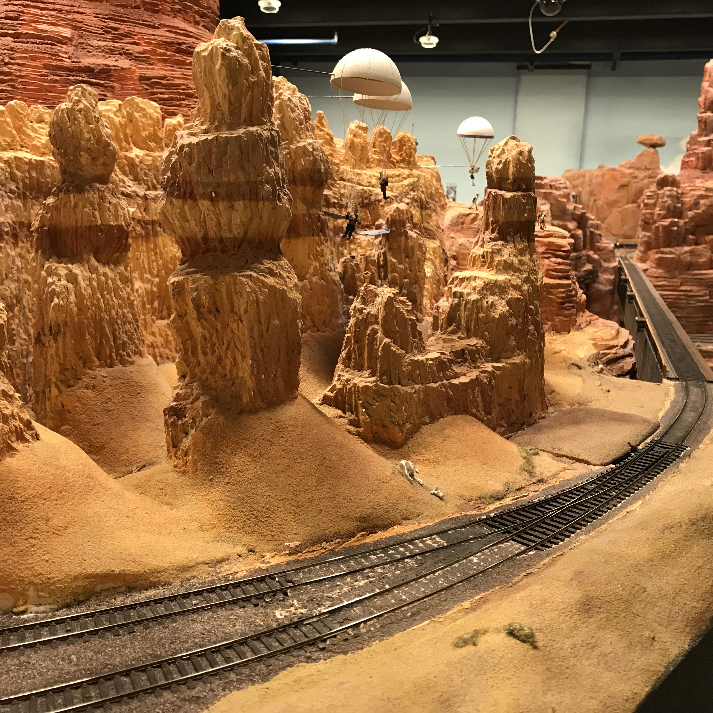

[返回目录](README.md)

## 十五、汉堡

- 时间：2019年12月20日~23日
- 同伴：mhy, qhf, mwx
- 交通：火车
- 路线：曼海姆 - 汉堡 - 吕贝克 - 汉堡 - 法兰克福 - 曼海姆
- 当地交通：地铁，公交，步行
- 游玩景点：
    - 汉堡：市立公园，市政厅，微缩景观，易北音乐厅
    - 吕贝克：波罗的海

### 12.20 DAY1 Hamburg: 

早上乘车前往汉堡，开始考试结束后的圣诞旅行！

{:height="200px"}

晚上时间逛了一会儿市中心的圣诞集市，好不热闹，有点像慕尼黑啤酒节。有卖各种小吃热酒的摊位，也有圣诞装饰品等小玩意儿的，原先就在路边的商店也都张灯结彩，类似中国的春节，人也是巨多。

### 12.21 DAY2 Hamburg: 

早起去**市立公园**晨练，之后前往**市政厅**门口的圣诞集市。

{:height="200px"}
{:height="200px"}
{:height="200px"}
{:height="200px"}

下午继续养生旅行，到港口附近转了转，然后去看**微缩景观世界**。里面的景观做得非常精致，是按照现实世界仿制的。我印象最深的是一个展区里多个桌面展示的是同一地点不同时期的变迁，从刀耕火种的时代，到中世纪，再到帝国、纳粹时期，很有意思。一大波图片。

{:height="200px"}
{:height="200px"}
{:height="200px"}
{:height="200px"}
{:height="200px"}
{:height="200px"}
{:height="200px"}
{:height="200px"}
{:height="200px"}
{:height="200px"}
{:height="200px"}
{:height="200px"}

之后顺路到**易北音乐厅**看日落（然而已经错过了，四点多日落谁顶得住啊）。

{:height="200px"}
{:height="200px"}

晚上去了一个有名的摇滚餐厅，略贵，算是情怀吧。

{:height="200px"}
{:height="200px"}

### 12.22 DAY3 Lübeck：

上午坐车前往吕贝克。吕贝克小地方交通不太方便，又逢下雨，有点难受。下午时间去了吕贝克的海边小镇看波罗的海。粗略算一下，交换时去看过4次地中海（希腊，威尼斯，巴塞罗那，伊斯坦布尔），1次北海（挪威）和1次波罗的海，还不错。

{:height="200px"}
{:height="200px"}

海边更冷，风还大，根本顶不住。落日时有些诡异的粉红色和突兀的灯塔让我想起了《湮灭》。

{:height="200px"}

被冻成狗的四人。和奥斯陆的合照神似。

{:height="200px"}

这天刚好冬至，看完落日后我们迅速回到住处，煮上热气腾腾的饺子，举杯庆祝。眼前又恍惚显现四个人在挪威的民宿，只是彼时手中的是月饼。中秋到冬至，不禁让人慨叹时光易老，交换的快乐即将结束，都十分不舍。

{:height="200px"}

顺带一提，我们在吕贝克住的民宿老主人是老一辈音乐家，家里收了两大柜子的CD，还有厚厚的歌剧谱子，我震惊。从CD展柜中搜到他自己的作品集，于是谷歌一下，是90年左右在吕贝克音乐学院学习，之后留校任教，近年回国养老去了，膜了。

### 12.23 DAY4 Lübeck：

早上坐火车之前在吕贝克继续逛了逛，进到一个塔楼参观。

{:height="200px"}

我还在路边看到了俾斯麦的雕像，北德嘛hhh

{:height="200px"}

晚上在法兰吃了最后一顿火锅，为马老板回国饯别。

&nbsp;

---

THE END

&nbsp;

[回到顶端](#十五汉堡)

[返回目录](README.md)