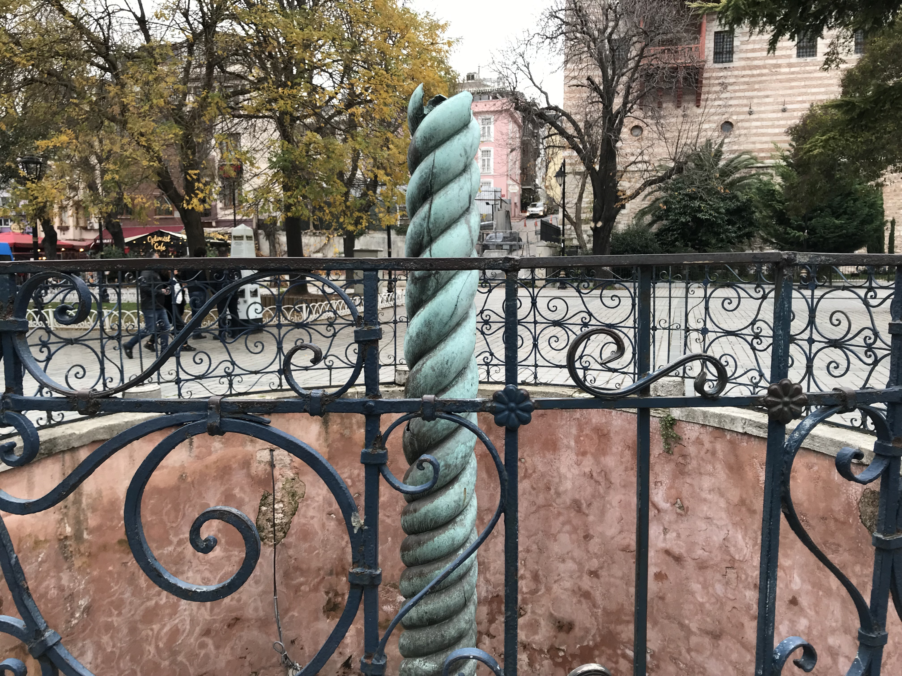
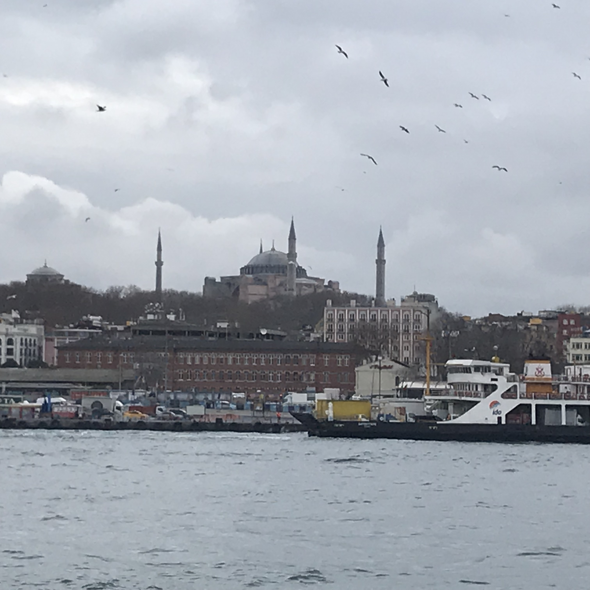
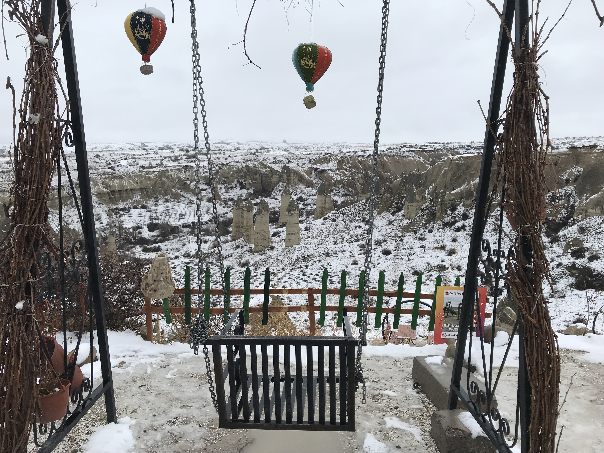

[返回目录](README.md)

## 十六、土耳其

- 时间：2019年12月24日~29日
- 同伴：qhf, mwx
- 交通：飞机，大巴
- 路线：曼海姆 - 法兰克福机场 - 伊斯坦布尔 - 格雷梅 - 费特希耶 - 伊斯坦布尔 - 法兰克福机场 - 曼海姆
- 当地交通：大巴，步行
- 游玩景点：
    - 伊斯坦布尔：圣索菲亚大教堂，蓝色清真寺，君士坦丁赛马场，君士坦丁纪念柱，大巴扎，苏莱曼清真寺，加拉塔大桥，加拉塔
    - 格雷梅：绿线，露天博物馆，爱情谷，玫瑰谷
    - 费特希耶：死海滑翔伞

### 12.24 DAY1 Constantinople: 

下午时间的飞机，晚上到达众城的女皇————君士坦丁堡。

土耳其人是真的热情得让我们觉得有些过头了，也许在他们眼中中国人就是钱吧。

晚饭被酒店坑了，去到一家宰客店，虽然味道还不错，但一条鱼两只虾130欧是太贵了。看到账单脸都绿了，就当是平安夜吃点好的吧。更好笑的是，秦狗她妈听说后去投诉了酒店，竟然还退回了一百多人民币，神奇。

{:height="200px"}
{:height="200px"}
{:height="200px"}

### 12.25 DAY2 Constantinople：

早上直奔**圣索菲亚大教堂**，心心念念的圣所，开始了情怀之旅。

{:height="200px"}

索菲亚内部，基督文化与伊斯兰文化交融。

{:height="200px"}
{:height="200px"}
{:height="200px"}

其实圣索菲亚大教堂相比于其他后来建成的清真寺，在外形上显得有些破败了，但这也说明了其悠久的历史。虽然外观的视觉冲击力没有很强，内部还是相当令人震撼的。

之后我们前往正对面的**蓝色清真寺**，并脱鞋进入参观。

{:height="200px"}
{:height="200px"}

直通圣索菲亚大教堂的广场，1453年Fatih正是沿着这条路到达大教堂的。（不得不提一句，中午吃饭的烤肉店WiFi密码是1453Istanbul，精罗落泪）

{:height="200px"}
{:height="200px"}

接着前往**大巴扎**逛逛，途经君士坦丁纪念柱。在大巴扎里真的挺尴尬的，因为店主总是热情地要拉着你进店，只好装作没听见。

{:height="200px"}

下午去了**苏莱曼清真寺**，就建在**金角湾**边，能看到**加拉塔大桥**和对面的**加拉塔**。个人认为这是颜值最高的清真寺了，干净素雅。

{:height="200px"}
{:height="200px"}

接着乘坐游船在金角湾、博斯普鲁斯海峡转悠，水上看这座横跨亚欧的城市。

海上看圣索菲亚

{:height="200px"}

Camlica Mosque

{:height="200px"}

穆罕默德二世为攻打君士坦丁堡建设的要塞（忘了叫啥名字了）。

{:height="200px"}

尽管当天下着雨，我们还是站在船顶的观景台上默默欣赏这座城风雨飘摇。

晚上乘飞机去**卡帕多奇亚**。一天时间确实来不及细细游览君士坦丁堡，下次有机会一定再来。

### 12.26 DAY3 Göreme：

天公不作美，由于下雨和下雪，我们在格雷梅的两天都无法坐上热气球（我们一走又开始有了【捂脸】）。有机会的话夏天再来坐浪漫的热气球。

于是在格雷梅的第一天我们报团游览**绿线**。卡帕多奇亚的地形就跟中国西北差不多，类似甘肃那一带的戈壁。

{:height="200px"}

**地下城**

{:height="200px"}

小教堂遗迹

{:height="200px"}

一小时徒步行走

{:height="200px"}

下午到这个洞窟里的教堂时雪已经下得挺大的了，上山下山的路都挺滑的，这种天气下第二天绿线就不会开，庆幸能赶上绿线旅行并看到这样壮观的雪景。

{:height="200px"}
{:height="200px"}
{:height="200px"}
{:height="200px"}

格雷梅第一天合照~

{:height="200px"}

### 12.27 DAY4 Göreme：

上午我们徒步前往**露天博物馆**。路上太令人窒息了，雪还在下着，但地上的积雪刚刚开始融化，踩上去吧唧吧唧地响，踏入一片水中，混合着泥土，真的是叫泥泞。南方人第一次知道下雪竟然这么恶心……

露天博物馆成功撞见一大群国人旅游团，大妈大叔们大喊大叫，竟还唱起歌跳起舞来，佛了。

{:height="200px"}

除去烦人的大妈们，露天博物馆还是挺不错的，卡帕多奇亚这种洞窟的风格我挺喜欢。

下午叫了辆吉普车载我们到**love valley, red valley, rose valley**等著名的景点兜了一圈。司机人很好，喜欢把车内音乐开最大，随着节奏左右漂移踩刹车，还时不时表演特技。最后在看日落的点给我们开了一瓶香槟，和我们一起喝了之后笑着说“no alcohol”。

{:height="200px"}
{:height="200px"}
{:height="200px"}
{:height="200px"}
{:height="200px"}
{:height="200px"}

据司机说这是四千年前的医院，不懂真的假的，鸽子很多倒是真的。

{:height="200px"}
{:height="200px"}
{:height="200px"}

格雷梅第二天也是最后一天合照~ 下雪的卡帕同样很美！

{:height="200px"}
{:height="200px"}

### 12.28 DAY5 Fethiye：

坐了一整夜的大巴，从格雷梅辗转来到海边的费特希耶，就是为了 滑！翔！伞！热气球凉了，滑翔伞是一定要玩的！

从海滩拉上山就花了将近半个小时，山顶的景色是真滴好哇！（已词穷）

{:height="200px"}

从山顶助跑跳下到滑翔伞撑开还是挺刺激的，等滑翔伞撑开之后就是缓缓滑翔了，看看风景拍拍照，高处有点冷的hhh

{:height="200px"}
{:height="200px"}
{:height="200px"}

降落时尽管看上去降落速度挺慢的，但冲击力还是震得jio疼。

{:height="200px"}

然后坐快艇在这片地中海东岸的海滩兜风。随着引擎的轰鸣戛然而止，我们交换的最后一次旅行也画上了句号。想哭。

{:height="200px"}
{:height="200px"}
{:height="200px"}
{:height="200px"}

### 12.29 DAY6 Constantinople：

归途。

&nbsp;

---

THE END

&nbsp;

[回到顶端](#十六土耳其)

[返回目录](README.md)