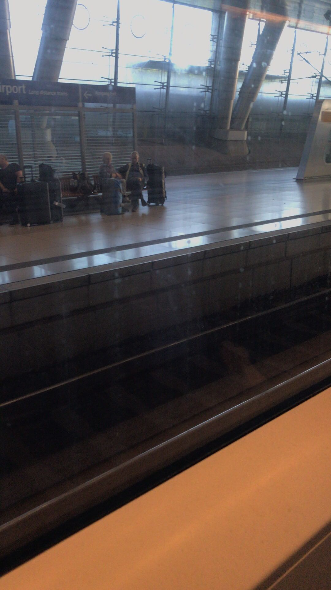
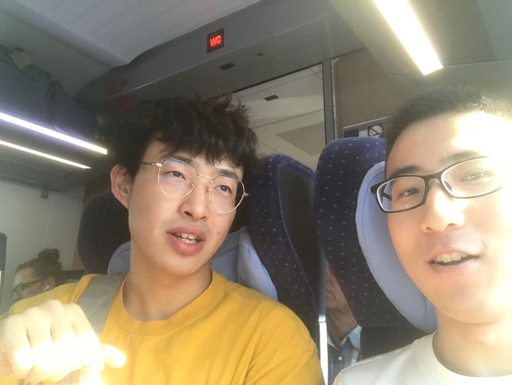
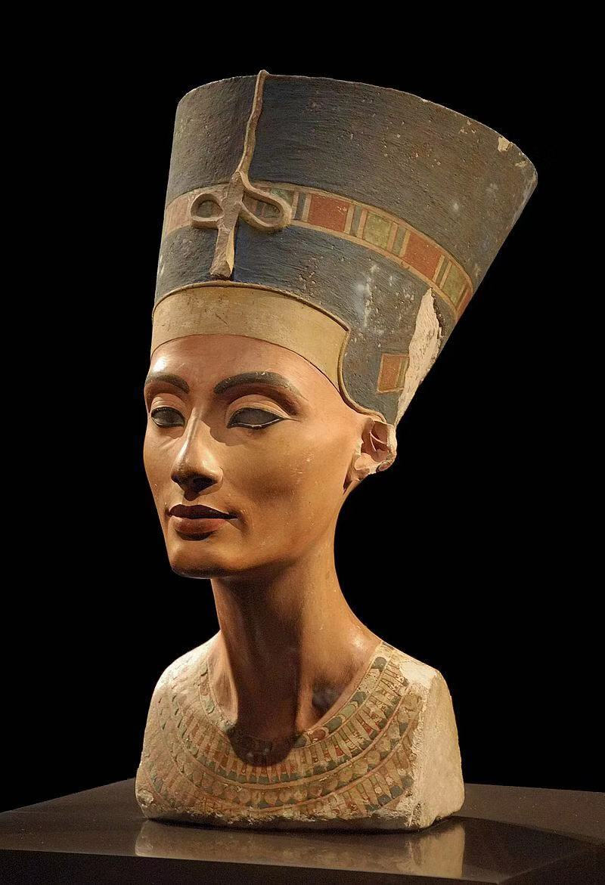
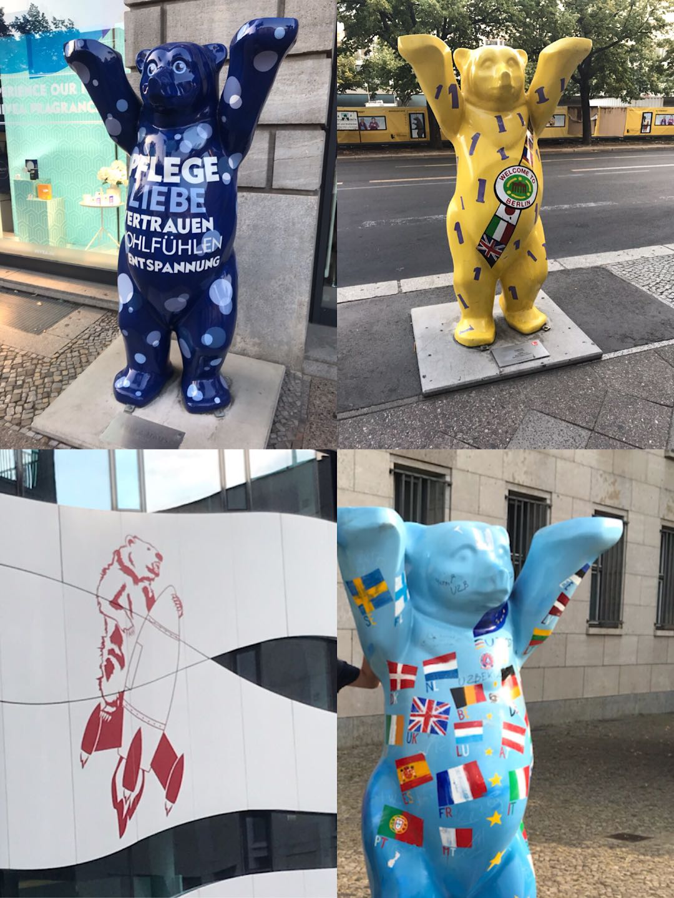

[返回目录](Preface.md)

<h2 id = "2">一、柏林</h2>

- 时间：2019年8月24日~26日
- 同伴：马老板
- 交通：火车ICE，德铁通票
- 路线：法兰克福机场 - 曼海姆 - 柏林 - 曼海姆
- 游玩景点：
   - 勃兰登堡门
   - 德国国会大厦
   - 佩加蒙博物馆，新博物馆，博得博物馆
   - 胜利纪念碑
   - 欧洲被害犹太人纪念碑
   - 查理检查站
   - 波茨坦广场

### 08.24, DAY 1: 

8月24日，到德国的第一天，拖着坐了十几个小时飞机麻木的身体，随着同行的一众小伙伴领了行李，找到法兰克福机场火车站，快速在DB服务台排队激活好在**国内就买好的德铁通票**，在工作人员善意的指导下，没费周折就找到站台，忐忑不安地等待去往曼海姆的火车。

具体时间我也忘了，大概是**7:50**左右成功搭上火车。第一次在德国坐火车，感觉车位置空间挺大，挺好，但初到异国他乡还是感觉很紧张。

    

约半个小时后达到**曼海姆火车站**，把行李放到离车站五分钟路程的住处，稍微整一下行李，就去赶大概**9:30**去**柏林**的火车咯。

在等车的过程中最大的发现就是德国的鸽子不怕人。它们就跟中国的流浪猫流浪狗似的，不惹人也没人睬它们，悠闲踱步，啄食地上的面包碎屑，时而扑棱棱来个俯冲，俨然车站之主。

这里提一句，**德铁通票**真的很方便，虽然在德国买火车票不麻烦，但对于初到德国的我，是通票让我能够在这么极限的时间里从法兰到曼海姆再去柏林的。

至于为什么我要第一天到德国就马不停蹄地赶到柏林呢，当然是因为8月24日晚上柏林勃兰登堡门的**柏林爱乐乐团贝多芬第九乐章露天音乐会**啦！这是后话，暂表不提。

大约10:00与马老板在法兰汇合！去柏林5个多小时的旅途中还有些轶事，一是刚开始不知道怎么看哪些座位是被预订的哪些是free的，导致**被人赶走**好几次，贼尴尬；二是同车厢德国青年们喝酒嗨皮，大喊大笑，两个妹子甚至热情地邀请马老板和我**一起喝酒**快活，被马老板无情拒绝hhh

    

大概**下午四点**到达柏林，花了点时间弄清楚该在哪买当地交通票（事实证明一次之后就很熟练了，以后的旅行都不需要晕头转向）。我们住的酒店在查理检查站附近，于是安顿之后就先去了**查理检查站**，一路经过教堂、音乐厅（具体名字我忘了2333），在**法国大教堂**旁边找了家餐馆吃到了特色的**猪肘、香肠、肉饼**，喝了德国啤酒，舒服。

    
    

饭后缓缓往**勃兰登堡门**走去，六点多达到已经有很多人等候的音乐会现场，结识了个中国老哥。老哥对音乐挺有了解，相谈甚欢。这次柏爱在勃兰登堡门的露天演奏会是他们的新指挥第一次在公众面前亮相，演奏的是贝九！所以才把刚到德国的我吸引到柏林hhh 这也多亏了曼海姆给力的小伙伴们先探听到消息，点赞！

    

柏爱+贝九，质量听起来就很高，德国人民音乐素养普遍也很高，即使是露天的音乐会，效果也很棒。特别是最后高潮欢乐颂那部分，周围的人们都跟着音乐**激情跟唱**，让人浑身战栗，都要流下泪来。结束后的掌声更是经久不息，就这样我们结束了柏林的第一天旅程。

    
    

### 8.25, DAY2：

第二天一大早，沿路去了**波茨坦广场、欧洲被害犹太人纪念碑**。

    

再次经过勃兰登堡门，前一天晚上的音乐会现场还没收拾完，然后到门附近的**德国国会大厦**。

    

逛完国会大厦就乘坐公交前往**博物馆岛**。之前买好了**博物馆通票**，所以岛上的博物馆可以随便逛。一开始我们没找到佩加蒙博物馆的入口，便先去了岛最北边的**博得博物馆**。之后晕乎乎终于找到入口的我们进入了**佩加蒙博物馆**，**Ischtar-Tor**和古罗马的那个集市大门是真的赞。

    

之后我们去了位于佩加蒙博物馆旁边的**新博物馆**，里面埃及的文物很有味道，特别是**Nefertiti的半身像**！！真的是神仙颜值，awsl！最后悔的事就是没有买一张她的明信片，以至于我以后去哪都会顺手带一两张明信片。

    

博物馆岛旁还有**柏林大教堂**，可以看到不远处的**柏林电视塔**。柏林比我想象中的要小多了，可以在一天内十分悠闲地走路逛完【捂脸】于是我们在下午两点多吃完午饭后回住处舒舒服服地睡了一个午觉2333

    

下午五点多我们醒了，继续出门溜达，去了**东边画廊**。除了超级出名的**兄弟之吻**，还有其他好多涂鸦都挺好看。

    
    
    

然后我们乘车到勃兰登堡门again……从一条好多人在跑步的直道，走了一个世纪，到达**胜利纪念碑**下。

    

天色挺晚的了，九点多我们在酒店附近误入一家牛排店，人均200+RMB，心疼。带血的牛肉吃不太习惯，但服务还不错。（~~你都付那么多钱了服务当然好了啊喂！~~

    

### 8.26, DAY3：

上午坐火车回曼海姆，柏林之行愉快结束。附上拍的一些柏林熊。

    

---

THE END

---

[回到顶端](##2)

[返回目录](Preface.md)