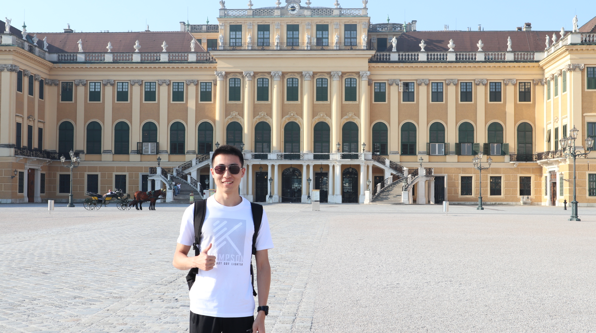
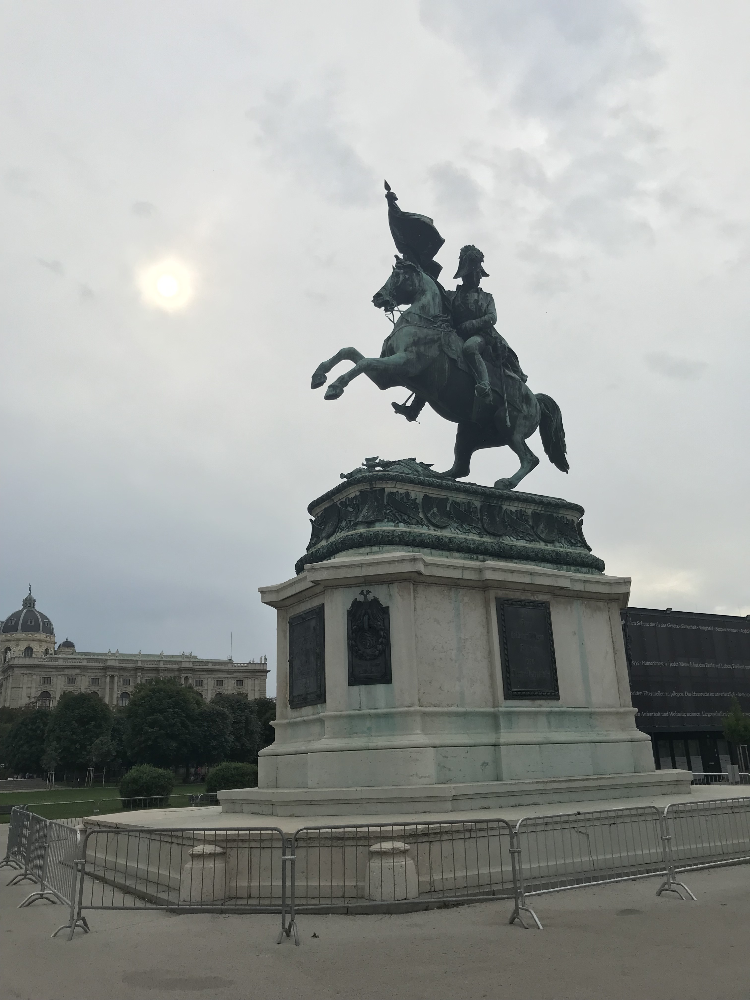

[返回目录](index.md)

## 二、奥地利

- 时间：2019年8月30日~9月2日
- 同伴：qhf
- 交通：火车ICE，德铁通票
- 路线：曼海姆 - 萨尔茨堡 - 维也纳 - 曼海姆
- 当地交通：酌情在自助售票机购买地铁1天或2天通票
- 游玩景点：
    - **萨尔茨堡**：萨尔茨堡音乐节、莫扎特故居、莫扎特广场、主教宫广场、萨尔茨堡大教堂、卡皮特广场、萨尔茨堡城堡、Nonnberg修道院、米拉贝尔宫、米拉贝尔花园
    - **维也纳**：美泉宫、霍夫堡皇宫、茜茜公主博物馆、圣斯蒂芬大教堂、黑死病纪念柱、圣彼得教堂、英雄广场、艺术史博物馆、国家歌剧院、金色大厅、莫扎特雕像、城市公园、多瑙河

### 8.30 DAY1 Salzburg：

刚忙完入学的一些破事，8月30日就继续踏上旅程。ICE火车，傍晚到达萨尔茨堡。由于还是夏天，天色暗的比较晚，我就一个人出去溜达溜达。

从住处沿路走向市中心，经过了**莫扎特故居**。

    

&nbsp;

过了桥就是主要景点聚集地，在胡同里漫步，走到**莫扎特广场、主教宫广场、萨尔茨堡大教堂、卡皮特广场**。

    
    
    

&nbsp;

接着我沿山路向**萨尔茨堡城堡**走去。没有进入城堡，只是在蜿蜒的山路俯瞰小城，惊喜地收获夕阳下的美景。

    
    

&nbsp;

### 8.31 DAY2 Salzburg：

第二天早上再咖啡厅用过早餐，便去听早早安排好的**萨尔茨堡音乐节**音乐会了。街上随处可见音乐节的旗帜，连吃早餐的咖啡厅里也挂着节目单。

    

&nbsp;

我们听的这场是贝多芬和布鲁克纳的曲子，人生第一次听维也纳爱乐乐团，虽然不是在金色大厅，但着实十分激动。

    

&nbsp;

入座后发现买的位置挺靠前，不需要用到望远镜，算是白白准备了hhh 接下来便是尽情陶醉的两个小时。

    

&nbsp;

音乐会结束后简单吃了点烤肉、牛肉汤，这家店柠檬味的啤酒还不错，和果汁似的。

这里不得不提一件能让我笑一学期的事。在莫扎特广场上走着的时候，一个老奶奶过来递给qhf一支玫瑰，qhf竟然傻愣愣的接过来了！老奶奶还想给我一支，我连忙摆手走开。于是老奶奶就缠着qhf要钱，我在一旁笑得直不起腰，哈哈哈哈！最终交涉过后qhf把花退还给老奶奶并给了她2欧。【捂嘴】

接着再到山上转了转，进去音乐之声里的 **Nonnberg Abbey** 看了看，幽静肃穆，好地方。

    

&nbsp;

下午去到**米拉贝尔宫**和**米拉贝尔花园**，但太阳太大，很快就溜了。

    

&nbsp;

傍晚乘火车前往维也纳，萨尔茨堡之行暂告一段落。

### 9.1 DAY3 Vienna：

大清早（其实也不早，八点多了）我们就起床坐地铁前往**美泉宫**。

    

&nbsp;

由于到的比较早，避开了一大波旅行团，血赚，美泉宫宽阔壮丽（当然太阳也很大）。我们没有进宫里游览，因为之后要去霍夫堡皇宫的。其实现在逛了那么多欧洲的城堡皇宫，里面的陈设展览都大同小异，去过三四个也没有那么大的兴味了。

所以我们就在美泉宫周围转了一圈，拍拍照，登顶，折返，往市中心去了。

    

&nbsp;

前往市中心坐地铁很方便，推荐在**Stephansplatz**或**Herrengasse**这两站下，主要景点基本可以在这一带步行达到。Stephansplatz这站一出站就能看到**圣斯蒂芬大教堂**。

    

&nbsp;

下一站**霍夫堡皇宫**。我们事先买了票，我记得是叫什么“Sisi Ticket”，**茜茜公主博物馆**、**银器馆**和霍夫堡皇宫都可以逛。

    

&nbsp;

常规逛博物馆，看到茜茜公主的衣服好漂亮，（腰好细），印象最深的是那套全黑的，连我一个直男都惊叹艳羡。

    

&nbsp;

午饭在**圣斯蒂芬大教堂**附近的那条街（貌似是叫**格拉本大街**？）解决的，吃到了维也纳的**肋排**，味道很不错，吃完把一根根完整的排骨码在盘子里特满足。

    

&nbsp;

顺便的，那条街饭馆多游客多，景点也多，像**黑死病纪念柱、圣彼得教堂**。

    

&nbsp;

下午看景点的顺序我忘了，时间有点久远，大概就是打卡了**艺术史博物馆**

    

&nbsp;

**英雄广场**

    

&nbsp;

**莫扎特雕像**

    

&nbsp;

**国家歌剧院**、**金色大厅**（由于是周日，没法进去参观）

    

&nbsp;

**城市公园**。最后选择困难症回到中午吃饭的地儿吃了晚餐hhh

    

&nbsp;

饭后乘地铁去**多瑙河**畔看了会儿夜景，吹了会儿风（当然，那时候的风并不冷），就回住处休息了。

    
    

&nbsp;

### 9.2 DAY4：

回程。

&nbsp;

---

THE END

&nbsp;

[回到顶端](#二奥地利)

[返回目录](index.md)