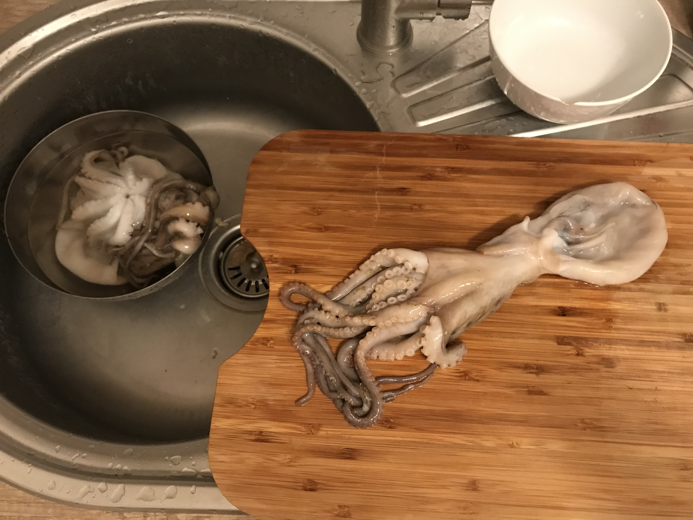
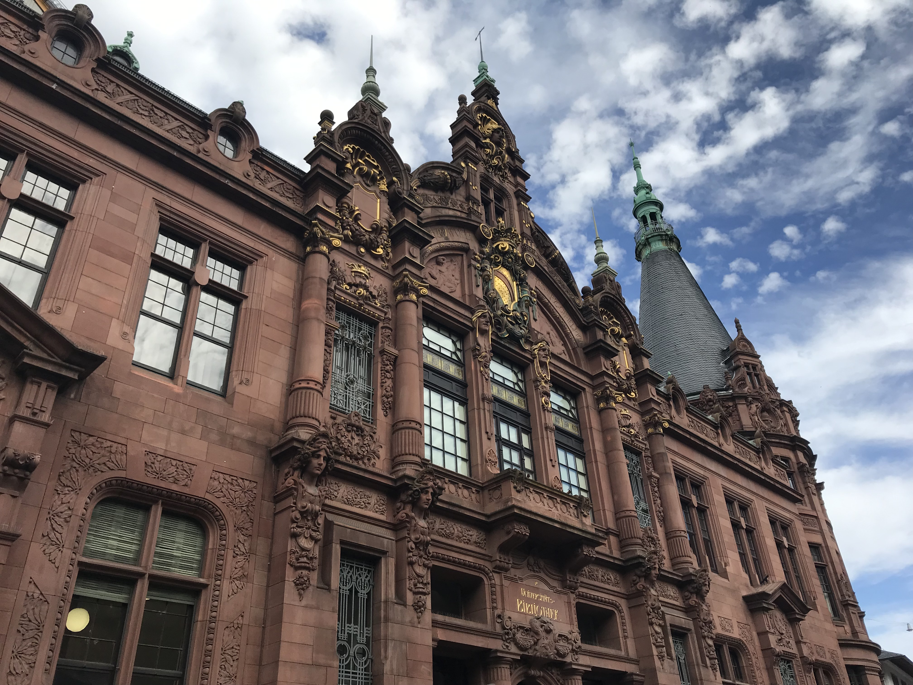
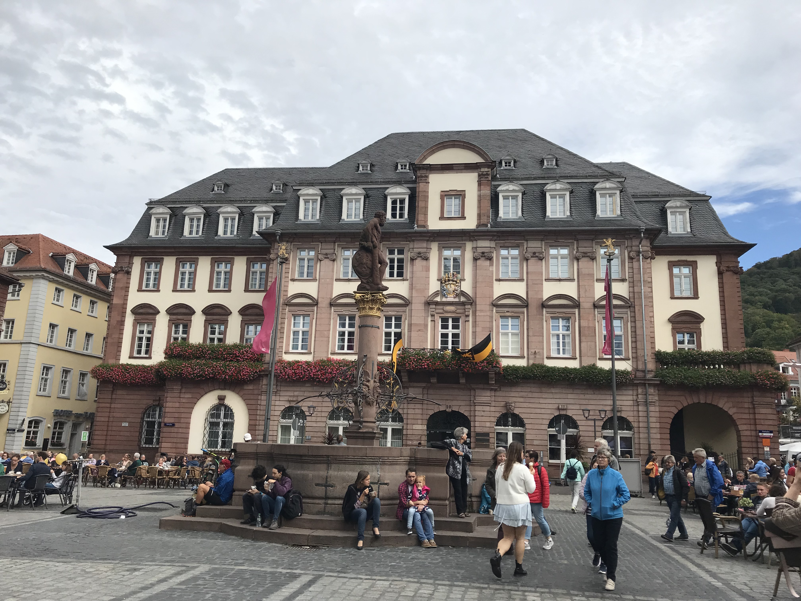
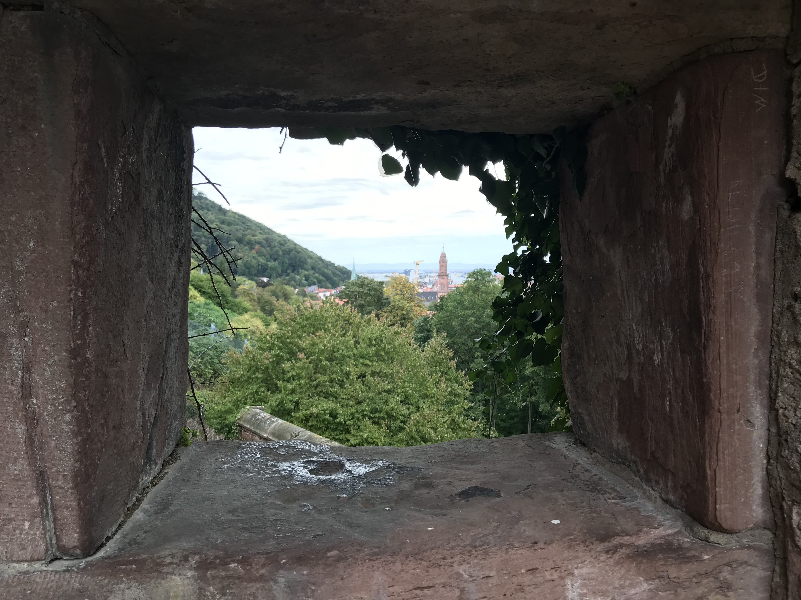
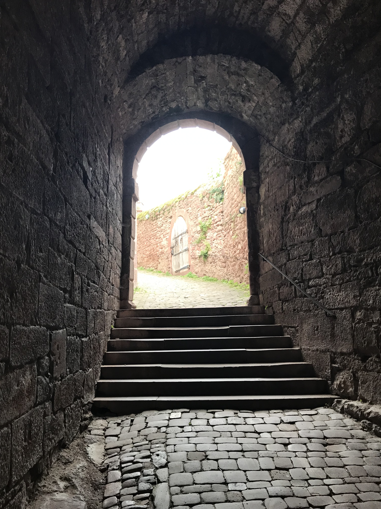
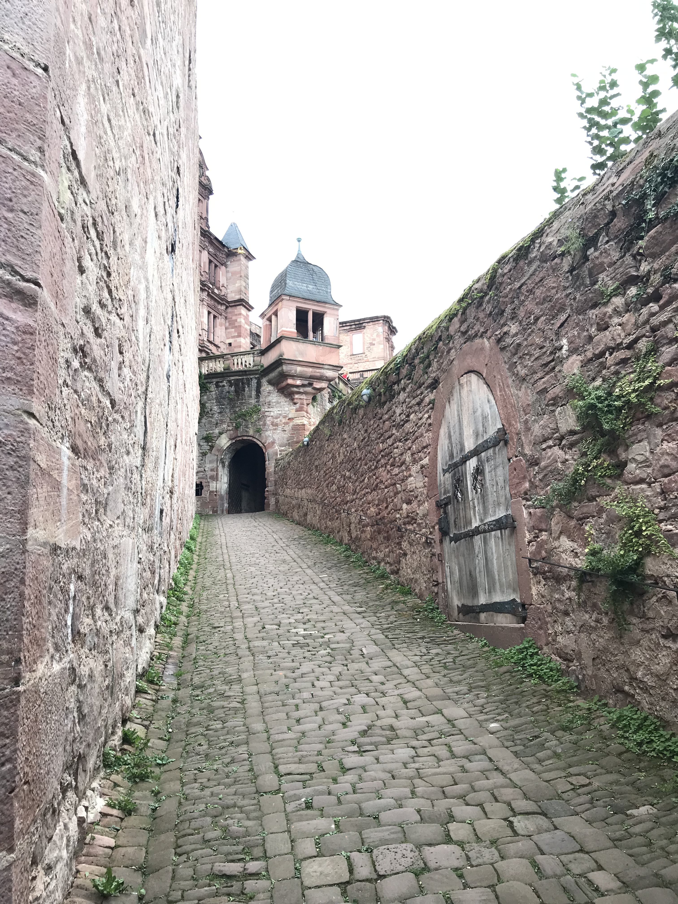
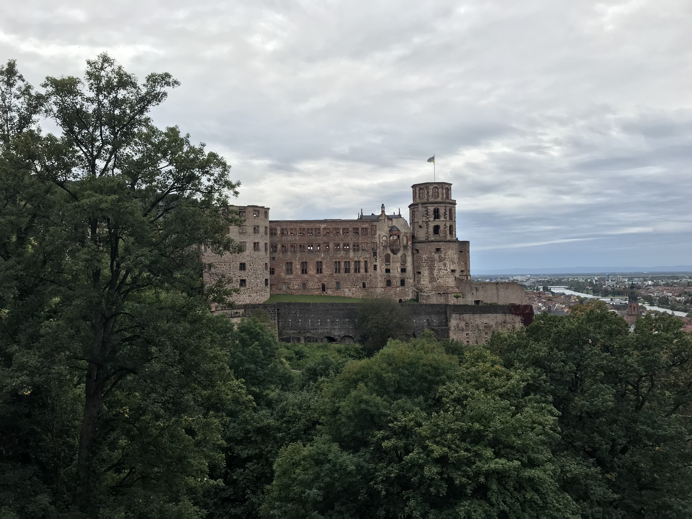
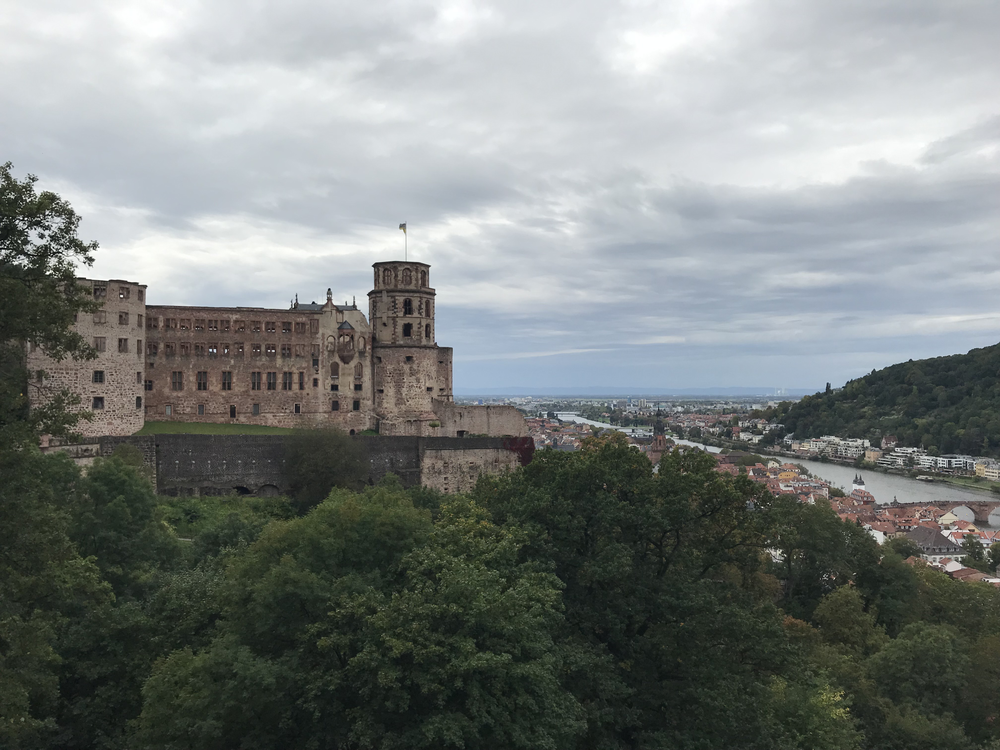
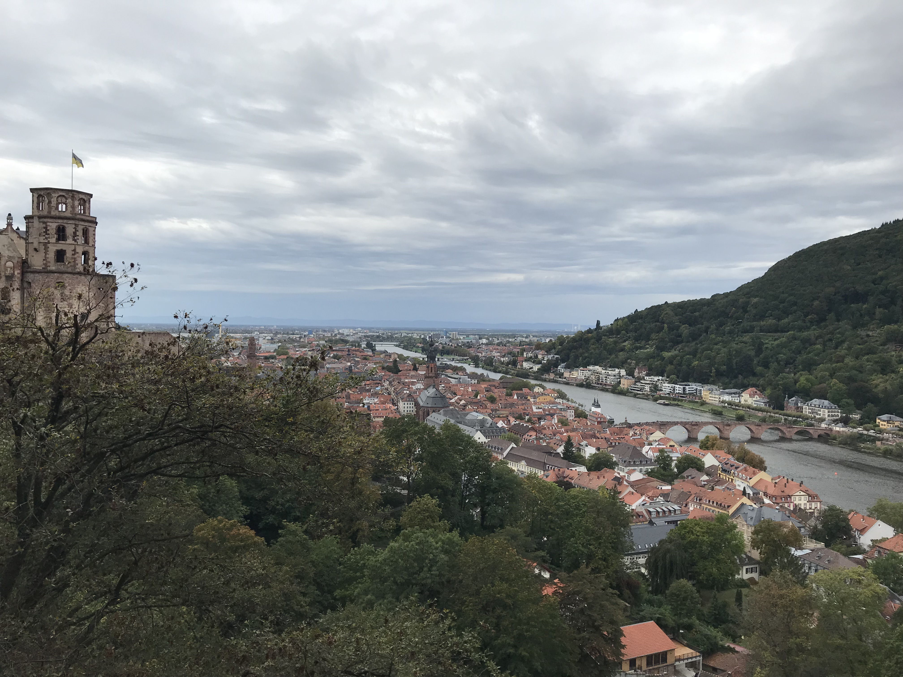

[返回目录](Preface.md)

<h2 id = "6">六、海德堡</h2>

- 时间：2019年9月29日
- 同伴：qhf
- 交通：火车
- 路线：曼海姆 - 海德堡 - 曼海姆
- 当地交通：公交
- 游玩景点：城区，海德堡大学图书馆，海德堡城堡

### 9.29 DAY1 Heidelberg: 

这个周末打算待在家休养生息，刚巧qhf来曼海姆玩，曼海姆又没什么好玩的，就和她一并去了海德堡。

附上那个周末的饭

    
    
    

&nbsp;

我们买的巴登符腾堡州票，从曼海姆到海德堡的火车、海德堡的公交都可以坐。

早上由于家里门锁故障，十二点多才出发……到达海德堡车站后坐公交进到市中心，首先看到的是一座教堂和**海德堡大学图书馆**，就进去逛了逛。

    

&nbsp;

然后在市中心狭窄的街道上人挤人……旅游城市真是名不虚传，路过了好多个广场，也没有太深印象。

    

&nbsp;

接着去城堡，爬了小小一段山（其实就是有点坡度的石路）。

    
    
    

&nbsp;

城堡我们没有进去，因为我们都看腻了城堡，而且还要买门票……

于是在城堡绕了一圈，建筑还是蛮好看的，也有被称为花园的绿化区……不过高处望下去景色不错，海德堡尽收眼底。

    
    
    
    

&nbsp;

之后下山，正想去学生监狱的时候下起了雨，于是坐公交回车站，返回曼海姆。海德堡总计游览3小时hhh

随便附上两张图

    
    

&nbsp;

&nbsp;

---

THE END

[回到顶端](##6)

[返回目录](Preface.md)
