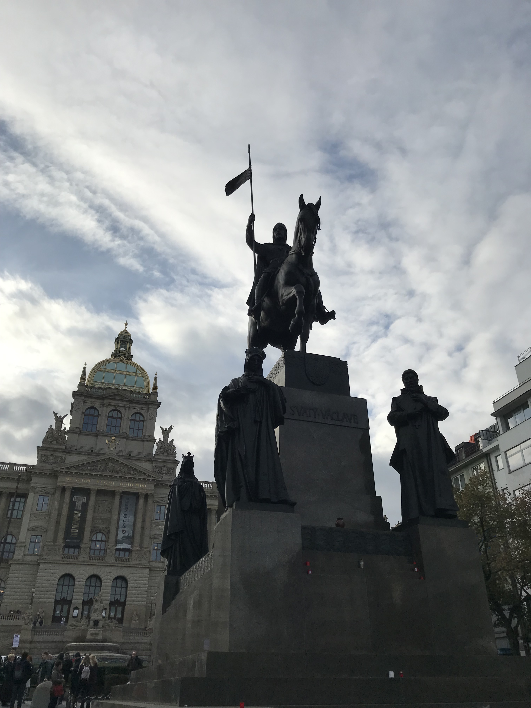
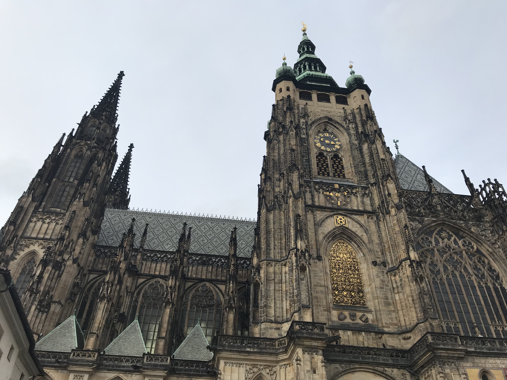
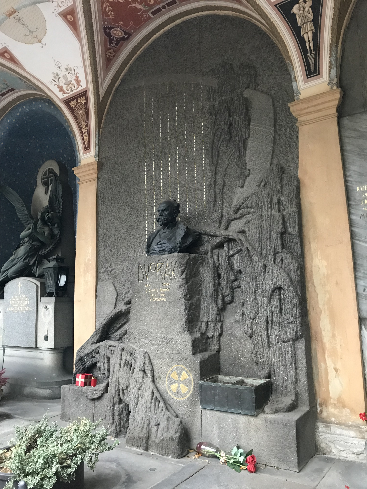
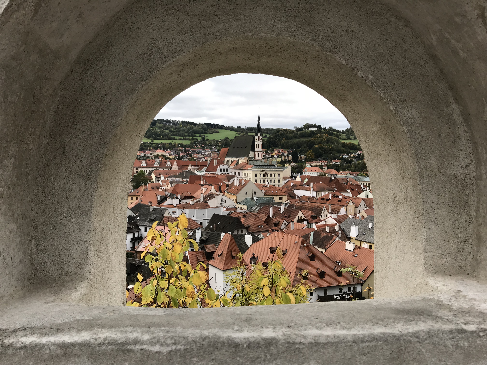
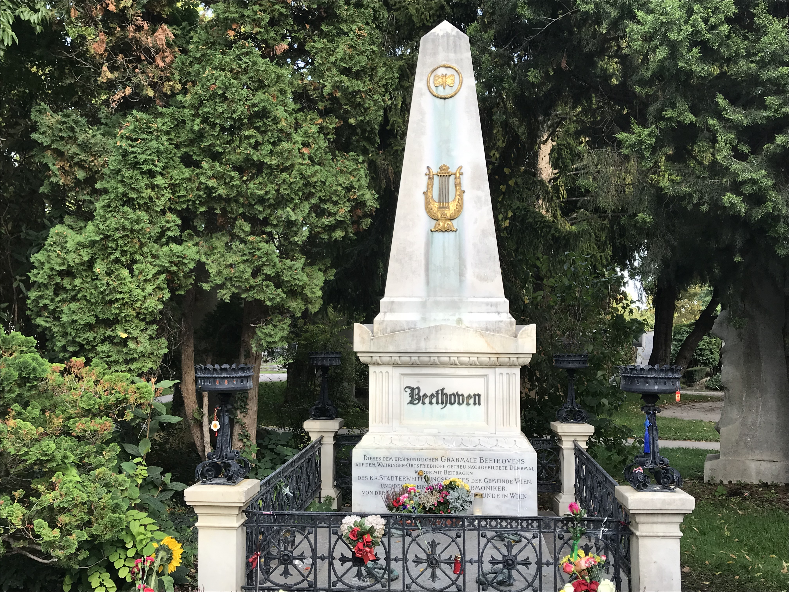

[返回目录](README.md)

## 七、捷克

- 时间：2019年10月3日~10月7日
- 同伴：mwx, oyjy
- 交通：火车，大巴
- 路线：曼海姆 - 纽伦堡 - 布拉格 - Cesky Krumlov - 布拉格 - 维也纳 - 曼海姆
- 当地交通：布拉格市内地铁3天通票，布拉格到CK小镇坐大巴，布拉格到维也纳坐RJ的火车，维也纳市内1天地铁通票
- 游玩景点：
    - 布拉格：国家博物馆，瓦茨拉夫广场，火药塔，老城广场，泰恩教堂，天文钟，老城桥塔，查理大桥，列侬墙，卡夫卡博物馆，布拉格城堡（圣维特大教堂，旧皇宫，圣乔治大教堂，黄金巷），高堡公墓
    - CK小镇：镇内瞎逛
    - 维也纳：国家图书馆，维也纳中央公墓，美景宫

### 10.3 DAY1 Praha：

10月3日是德国类似国庆的日子，放假一天，我索性就把周五的AMS课翘了，来一场五天的旅行。

3号中午坐火车到法兰，转车到纽伦堡，再坐大巴到布拉格。晚上九点多入住，民宿非常非常好！房东超nice！我们是她的第三批客人，她超详细地跟我们介绍了布拉格并给出游玩建议，还准备了免费的牛奶、美味的自制曲奇。房子也很宽敞很舒适！位置在电视塔附近，搭乘地铁很方便。如果想去布拉格玩墙裂推荐这家民宿！

{:height="300px"}
{:height="300px"}

### 10.4 DAY2 Praha：

第二天天气不是很好，阴天，时断时续的小雨，一早坐地铁到museum站，一出地铁站就能看到**国家博物馆**。

{:height="300px"}

之后我们顺着**瓦茨拉夫广场**走向老城中心。

{:height="300px"}
{:height="300px"}

看了**火药塔**

{:height="300px"}

接着到达那个著名的**老城广场**

{:height="300px"}

周围有**泰恩教堂**、**天文钟**、**布拉格老市政厅**。

{:height="300px"}
{:height="300px"}

老城区

{:height="300px"}
{:height="300px"}

我们在老城中转悠的同时，也被当地的特色冰淇淋所吸引hhh 边在风中瑟瑟发抖边舔这冰淇淋，舌头冻僵也无所畏惧。

{:height="300px"}

然后我们到了**老城桥塔**，登上塔顶（当然是要收费的），可以俯瞰老城标志性的红顶建筑群

{:height="300px"}
{:height="300px"}

**查理大桥**上密密麻麻的人也可以看得一清二楚。凛冽的风伴随着**伏尔塔瓦河**袭来，仿佛烈酒冲动人的神经。

{:height="300px"}
{:height="300px"}

挤过查理大桥，就去河边打卡**列侬墙**。说实话，这面涂鸦墙挺让我失望的，杂乱无章，毫无美感，与柏林的东边画廊根本没法比，就像个乡下的小混混。只勉强拍了张列侬留念。

{:height="300px"}
{:height="300px"}

午饭后，我们去打卡**卡夫卡博物馆**，门票180捷克克朗，略贵。博物馆里的装饰布置挺合我意的，用昏暗与刺眼的白光渲染出卡夫卡特有的那种略带压抑的心境，印象最深的是刚踏上二楼便响起的《伏尔塔瓦河》，令人心中一颤。馆内陈列的基本是卡夫卡相关的书信，如果不是对卡夫卡很有研究的朋友估计不会太感兴趣。

{:height="300px"}

之后乘电车前往山上的**布拉格城堡**。B类票的学生票是125捷克克朗，挺便宜的，可以参观**圣维特大教堂**、**旧皇宫**、**圣乔治大教堂**和**黄金巷**，对我们来说已经足够了。

{:height="300px"}

圣维特大教堂无论是外观还是内部都十分壮观，值得一看；

{:height="300px"}
{:height="300px"}
{:height="300px"}
{:height="300px"}
{:height="300px"}

旧皇宫则与其他我参观过的欧洲宫殿相形见绌，没有亮点；

圣乔治大教堂我没有进去，外观看上去没有圣维特大教堂宏伟；

黄金巷则是类似景区步行街那样，只是更有韵味罢了。

{:height="300px"}

参观完这些一个下午的时间也就过了，我们就去城堡上的**观景台**拍照，全城尽收眼底，不愧是无数人儿魂牵梦萦的布拉格，不错不错。

{:height="300px"}
{:height="300px"}

接下来由于我的特殊癖好，就安排去**高堡公墓**。坐了将近半个小时的电车，穿过伏尔塔瓦河，从城北到城南，向上攀登了大概十分钟，终于到达打卡地点。

{:height="300px"}

我熟练地在公墓门口按图索骥，定位到**德沃夏克**和**斯美塔那**长眠的位置，步入园中进行参拜（拍照）。

{:height="300px"}
{:height="300px"}

晚上我们抢在亚洲超市关门前购买到食材，回民宿准备了一份部队火锅，以美食为我生日的布拉格之旅作结。

{:height="300px"}
{:height="300px"}

### 10.5 DAY3 Cesky Krumlov：

刚到布拉格的那天晚上我们还在犹豫要不要两天都逛布拉格，不去CK小镇了。事实是，我们一天就把布拉格几乎所有想去的景点都看完了（虽然是腿断布拉格），于是这天我们就乖乖前往小镇。

九点多的大巴，大概十一点多到，依然是阴天，但似乎没有下雨。我们从车站往镇内边走边观景，小镇确实是名不虚传，虽然亚洲游客很多（但我们去的那天也许是天气原因，还不至于人挤人），但镇里的街道建筑让人很舒服，自然风光也是极美，其实是值得三个小时的车程的。

午饭在一家挺火的Papa's餐厅吃，排了一会儿队，但菜还是挺不错的，服务员态度也很好。现在我越来越怀疑TripAdvisor上的一些中文评论“服务态度差”，已经碰到过两次有这个评价的餐厅实际上服务态度很好的了，应该就是一些国人自己的问题，不能怪服务员。

{:height="300px"}
{:height="300px"}

小镇很小，没多久就逛了一圈，甚至还去了一个叫**酷刑博物馆**的奇奇怪怪的地方，其实跟鬼屋差不多。

然后我们去了观景台俯瞰拍照，再去另一个高点，一座塔上365度无死角旋转拍照hhh 

{:height="300px"}
{:height="300px"}

塔上的狂风不时吹得人窒息，但我们还是抓住风喘息的机会，整理好不成样的头发，强颜欢笑抢时间拍照【呲牙】

{:height="300px"}
{:height="300px"}
{:height="300px"}

恋恋不舍地在塔上逗留了许久，我们才掐时间到车站，返回布拉格。这里顺带说一句，布拉格到CK小镇的大巴有两种，早晨我们坐的是RegioJet的，晚上坐的是Leo Express的，Leo的大巴简直不要比RJ好太多！同样的价位，RJ的车是真的破烂，人是真的多且吵，乘务员态度是真的不好，强烈推荐Leo！但有的班次Leo会比RJ贵，但我觉得是值得的！

在CK小镇的其他一些照片

{:height="300px"}
{:height="300px"}
{:height="300px"}

晚饭在布拉格找了一家小酒吧，酒保大叔也很幽默很nice，更重要的是，巨便宜，量巨多！烤半只鸭子也太实诚了！30欧3个人吃撑了！

{:height="300px"}

### 10.6 DAY4 Wien：

早上坐车前往维也纳，下午一点多到中央火车站。住处离火车站就3分钟的步行距离，是个比较现代化的大公寓楼里的一间，虽没有哪方面特别好，但性价比很高。

再次来到维也纳，再次坐地铁到熟悉的Stephensplatz站，再次一睹皇宫的风采。由于mwx和oyjy是第一次到维也纳，大多时候我们是分头行动，这里就只记录我的行程了。

{:height="300px"}

我先到上次没有进去的**国家图书馆**states hall。里面的书籍古色古香，与绚烂的壁画相得益彰，着实漂亮。

{:height="300px"}
{:height="300px"}
{:height="300px"}
{:height="300px"}

接着坐半个小时的地铁和电车到**中央公墓**，打卡32A区，莫扎特贝多芬舒伯特施特劳斯勃拉姆斯都住一块儿，真好。真所谓坐车一小时，打卡三分钟。

{:height="300px"}
{:height="300px"}
{:height="300px"}
{:height="300px"}
{:height="300px"}
{:height="300px"}

由于是周日，金色大厅没开门，我们就没有安排去看，转而决定去**国家歌剧院**。

五点多钟我们在国家图书馆附近汇合，去国家歌剧院排队晚上歌剧的站票。最终六点多成功排上，进入歌剧院。七点钟歌剧开始，通过百度我们了解到这个剧情还有点意思（光听德文当然是听不懂了啊喂）。第一幕之后站票听众散去许多，我们得以看到扶手边的小显示屏上的英文字幕。站两个多小时体验国家歌剧院还是挺值得的。

{:height="300px"}

### 10.7 DAY5 Wien：

早上她俩早起去了美泉宫，我则睡了个懒觉，消除了几天旅行的疲劳，在离住处5分钟步行距离的**美景宫**散了个步，感觉非常好。

{:height="300px"}
{:height="300px"}

之后我们便搭乘火车，回程。自己的20岁生日在布拉格度过，也算是极佳的体验吧，布拉格没有让我失望，算是了了一片念想；维也纳这个大都市同样没有让二刷的我感到无聊，逛的景点同样精彩。

&nbsp;

---

THE END

&nbsp;

[回到顶端](#七捷克)

[返回目录](README.md)