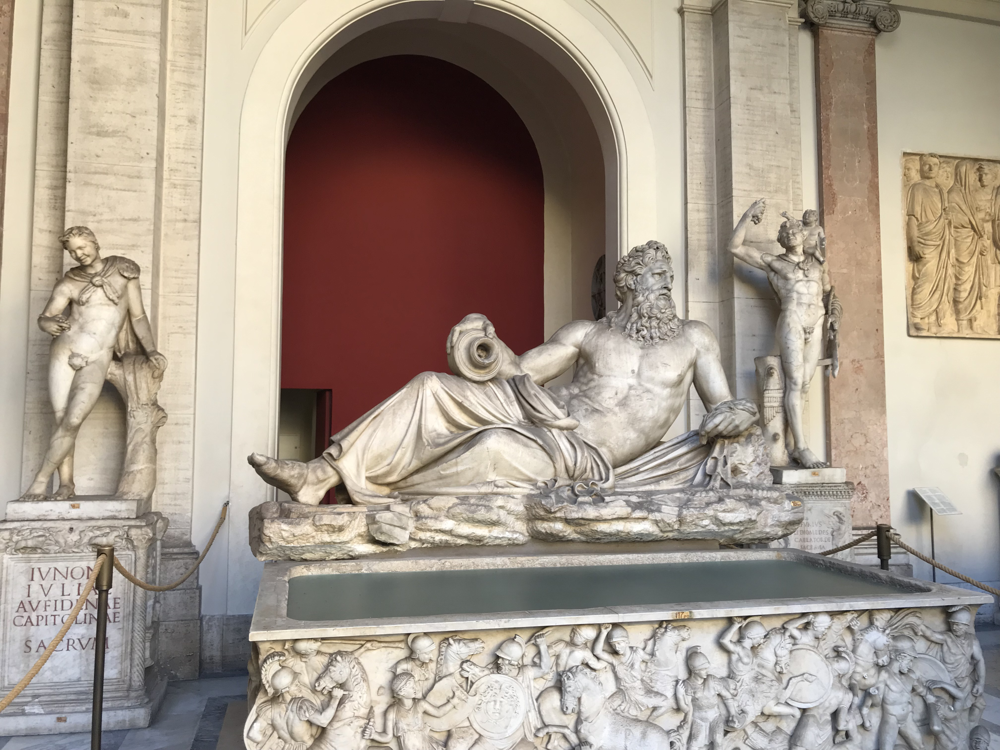
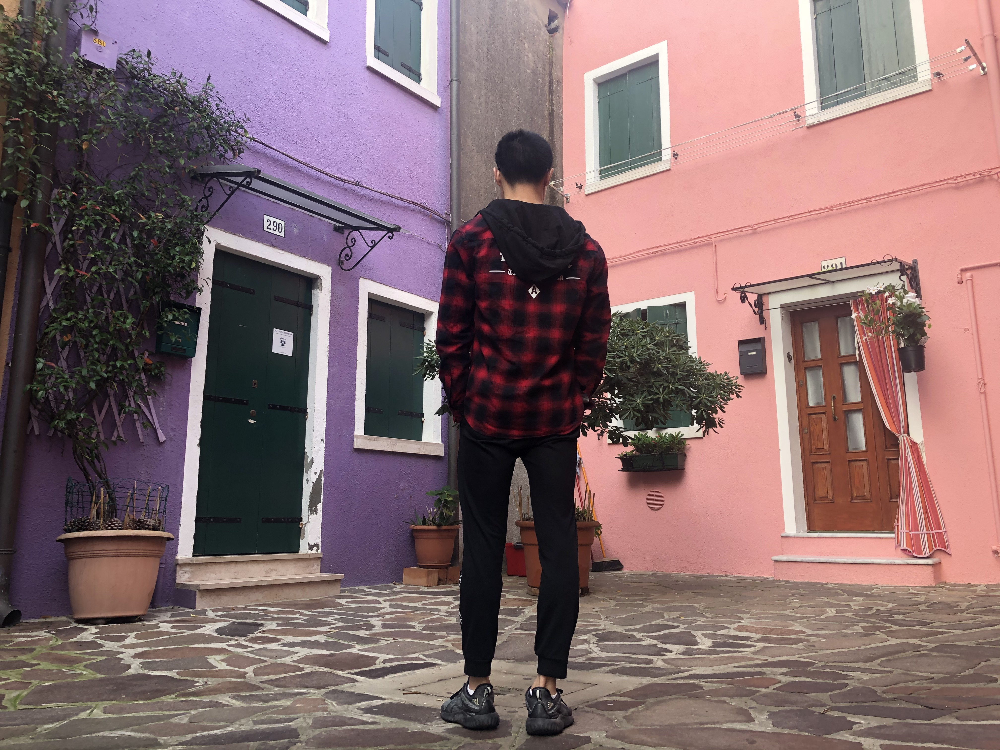

[返回目录](README.md)

## 九、意大利

- 时间：2019年10月18日~10月21日
- 同伴：mhy
- 交通：飞机，火车
- 路线：曼海姆 - 罗马 - 威尼斯 - 法兰克福 - 曼海姆
- 当地交通：罗马买单次地铁票，主要步行；从罗马到威尼斯坐火车；威尼斯买日票，可坐大巴和船
- 游玩景点：
    - 罗马：斗兽场，古罗马广场周边，真理之口，圣天使城堡，纳沃纳广场，万神殿，特莱维喷泉，西班牙广场
    - 梵蒂冈：圣彼得广场，梵蒂冈博物馆，圣彼得大教堂
    - 威尼斯：主岛，Burano（彩色岛），Murano（玻璃岛）

### 10.18 DAY1 Roma: 

为了赶周五中午廉价的飞机，熟练地翘掉AMS课去法兰机场hhh 到罗马的机场后花了些时间等去市中心的大巴，大巴体验不是很好，晚点+人超多+车内环境差+略贵，大概下午三点多才到市中心。

安顿下来后找了附近的一家餐馆补上午饭，略贵，甚至还被蚊子咬了好几个包。

{:height="300px"}

吃完后向斗兽场前行。不得不吐槽罗马的路……是真的很少见斑马线，更不用说红绿灯了，过马路就讲究一个“莽”字，让我非常慌。而且常常十字路口只有一条或两条斑马线，迷惑。

到**斗兽场**时正值日落，古老的圆柱形建筑熨上一层金色，很有时代韵味。

{:height="300px"}
{:height="300px"}
{:height="300px"}

然后继续瞎逛，在**古罗马广场**那一带逛了一圈。因为那时候应该是马上要关门了，所以就没进去（也不能进去）。

{:height="300px"}

轶事一则。逛的时候看到一个大叔在路边弹应该是吉他的弦乐器，我们就在这氤氲着浓情的空气中驻足。大叔忽然抬头，与我们相视一笑。"Chinese?""Yeah""Are you in love?"指着我和马老板。"???"重复了一遍问题。我连忙摆手。大叔略有失望地笑:"Oh, it seems to be."我连忙拉着马老板尴尬地走开。事后马老板insist大叔说的是"Are you involved?"问我们是否沉浸在音乐中，我不以为然。

莫名其妙绕到了**真理之口**。

{:height="300px"}

天色已晚，定位了家川菜馆，导航过去。唉，之前每次旅行都会想着吃当地特色，现在最怀念国内的美食。由于路中间隔了个大景区，好多路走不通，多次依据谷歌地图绕回原路白给，但也不算白给吧，也乱转看到了一些景点。

{:height="300px"}
{:height="300px"}

水煮牛肉，干锅排骨，鱼头豆腐汤，每人两碗米饭，舒服。

{:height="300px"}

然后在路边的一家店买了点明信片。讲真，意大利的纪念品是真的便宜，别处一张1-2欧的明信片，在罗马只要0.4欧，别处4-5欧的冰箱贴，在罗马只要1欧，血赚，于是买了一堆。

### 10.19 DAY2 Vatican & Roma: 

第二天七点半起床，坐地铁去梵蒂冈。先领略了**圣彼得广场**的壮观。即使那时候时间还早，广场上就排着准备进入教堂的长队了。

{:height="300px"}
{:height="300px"}
{:height="300px"}

拍了些游客照后本打算就溜了，结果一脸懵逼地被拉客的工作人员带进一个旅游团，不用排队就可进入**梵蒂冈博物馆**和**圣彼得大教堂**，还有导游讲解。当时两个人100欧的价格真是有点吓到我们，不过仔细算算还是不会很贵的，加上不用排队和人很nice的导游，其实挺值得。

{:height="300px"}
{:height="300px"}
{:height="300px"}

梵蒂冈就是不一样，进入建筑里能感受到四周都是美，十分壮丽。可算是见识了米开朗琪罗在西斯廷天花板上的壁画了，确实如同天神一般强无敌。但创世纪那间屋子不让拍照，就没把最经典的那个天花板照下来。

{:height="300px"}
{:height="300px"}

圣彼得大教堂。

{:height="300px"}
{:height="300px"}

这样我们原本30分钟的梵蒂冈打卡游就莫名其妙延长到了3个小时，事实证明进入博物馆和教堂参观还是必要的，它们既值得一看，又能帮助消磨在罗马的时光（我们当时完全没有想到下午时间竟要想方设法打发时间）。

午饭吃了海鲜意面，披萨还有冰淇淋，味道都十分不错。

{:height="300px"}
{:height="300px"}
{:height="300px"}

午饭过后一路向火车站方向边走边逛，先后路过了**圣天使城堡**

{:height="300px"}
{:height="300px"}

**万神殿**

{:height="300px"}

**特莱维喷泉**

{:height="300px"}

**纳沃纳广场**，**西班牙广场**。

{:height="300px"}

罗马的小巷别有一番风味，幽深（但不静谧……），各个角度看都很美。有时会忽而人少，走着走着却又到了游客密集之处。

{:height="300px"}

说到人，唉，罗马是真的人多，就跟中国景点似的。地铁快赶上13号线高峰了，以上提到的每个景点都是人头攒动，喷泉变为集体浴场，西班牙广场那个吃冰淇淋的台阶根本看不到台阶，都坐满了人hhh

中途数次在街头艺人面前驻足，投币听音乐。西班牙广场那边有个老哥弹唱，还蛮好听的，吸引了一个金发路人小哥和他合唱，效果不错。在老哥唱完当天最后一首准备收拾走人时，警察小姐姐适时地走上前开了张罚单。

{:height="300px"}

傍晚乘火车前往威尼斯，九点多到达。

### 10.20 DAY3 Venice: 

早晨七点早起，买日票，坐大巴进岛。这里推荐住在岛外的Metre火车站附近，（给我们住的a&o打个广告，性价比很高）无论是火车还是大巴进岛都很方便，物价也比岛内便宜。

我们计划到主岛后先去Burano，就是传说中的彩色岛，因为听说中午过后游客就会超多（这也是我们早起的理由，谁不想多睡一会儿呢！）。我们原先还盘算着七点多能看到日出，结果发现太阳没出来时的威尼斯就是雾气弥漫的，能见度极低，打扰了……

{:height="300px"}

九点多到达Burano，基本没有其他游客，岛上居民们也基本是刚起床，门户还紧闭着，各个餐馆和纪念品商店都还未开门。这种难得的“包场”的机会怎能浪费，在静谧中与裹着雾气的一幢幢彩色小楼相拥，爱了爱了。

{:height="300px"}

彩色岛另一个令我兴奋的点就是，我们误打误撞进了一家刚刚开门的面具店，里面绝大多数面具都是店主老婆婆和老爷爷手工制作的，用纸做好再自己上色。而且样式都是他们自己设计的，进店后不让拍照，我在之后的行程中特别注意了威尼斯其他卖面具的店铺，他们手工做的那些确实是独特的，不是那种量产的淘宝货。

一进门就看到了杰克斯派洛，瞬间兴奋，可惜我知道自己买不起……老婆婆非常热情，也许因为我们是当天的第一批顾客吧，带着我们几乎把店里的所有面具看了个遍，还具体介绍了威尼斯面具的历史来由，特别好。"You like my works. You want to take all of them."老婆婆操着一口不是很纯正的英语，哈哈，也许当时我的眼里是放着光的吧。

最后我挑了一堆小的面具冰箱贴，和一个手工狐狸面具。剁手之后心情就更加地好了，仿佛那刚刚将雾气驱散的阳光。

{:height="300px"}
{:height="300px"}
{:height="300px"}

Burano的另一特色就是蕾丝工艺，但蕾丝的围巾和衣服太贵了，我们选择参观蕾丝博物馆hhh

{:height="300px"}
{:height="300px"}
{:height="300px"}

以及拍了一堆沙雕照片。

{:height="300px"}
{:height="300px"}
{:height="300px"}
{:height="300px"}

午餐吃了刺身，贵就贵一点吧，好久没吃了。

{:height="300px"}

午饭过后前往Murano玻璃岛。玻璃岛的特色就是玻璃呗，由于那些玻璃看起来都像淘宝货，又贵，我也没敢买。玻璃博物馆挺有意思的，里面不仅展出好看的玻璃制品，还有大屏播放那些饰品的制作过程，很有意思。

傍晚回主岛，在威尼斯的小巷中穿行，好几次被谷歌地图带岔路，以及碰到同样被谷歌地图带到相同地方的游客们hhh

{:height="300px"}

晚餐体验了特色墨鱼面，味道不错，吃完嘴边黑一圈，哈哈。

{:height="300px"}

饭后在一座我不知道也不关心叫什么的桥上看着晚霞的余晖慢慢湮灭，在夜色中返回住处，结束此次意大利之行。

{:height="300px"}
{:height="300px"}
{:height="300px"}

### 10.21 DAY4: 

最后一天睡了个懒觉，下午到Treviso机场返回。无巧不成书，竟然在碰到了同坐一趟航班的mwx和wzx。

当时我在人群中看到登机口附近低着头坐着的女生有点像mwx，但瞬间打消了这个念头，因为她们的行程是先威尼斯后罗马，与马老板和我的行程完全相反，这个时候应该在罗马才对。我便自嘲，才几天没见怎么就这么想着呢，于是把这件事抛在一边。没过多久我正走着忽然被人拽住胳膊，抬头，mwx正一脸得意地看着懵逼的我。和她俩聊了几句，才知道原来她们也是为了乘这趟廉航，哈哈，果然金钱是联系人与人之间的纽带。而可怜的马老板正看着手机一路往前走，压根不知道背后正发生着他乡遇故知的戏剧性场景。

然后，辣鸡瑞安晚点了，导致赶不上原计划从法兰回曼海姆的那趟ICE，索性在法兰和马老板三人搞了一顿火车（wzx要赶火车就先走了），美滋滋。

{:height="300px"}

真是魔幻的一天。【呲牙】

这次意大利之行，罗马给我的印象中规中矩，抬头所见古时的辉煌，与低头看到的现世的些许落魄。而威尼斯的美就有些高于我的预期，我们属于非主流游玩威尼斯，并没有去主岛上的总督府啊那些景点逛，因为我们是真的看腻了教堂和宫殿。集中游览那两座外岛，自然风光要胜过人文景观，很好。

{:height="300px"}
{:height="300px"}

&nbsp;

---

THE END

&nbsp;

[回到顶端](#九意大利)

[返回目录](README.md)
